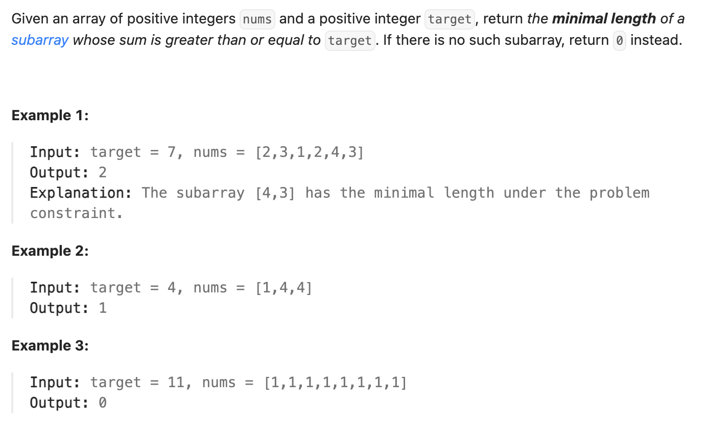

``` cpp
class Solution {
public:
    int minSubArrayLen(int target, vector<int>& nums) {
        // 滑动窗口，找属于每一位最短的长度
        int left = 0;
        int right = 0;
        int minLen = INT_MAX;
        int currSum = nums[left];

        while (left < nums.size()) {
            // 如果大于target，就把left往右移动
            if (currSum >= target) {
                minLen = min(minLen, right - left + 1);
                currSum -= nums[left];
                left ++;
            }
            // 如果小于target，就把right往右移动
            else if (right < nums.size() - 1) {
                right ++;
                currSum += nums[right];
            }
            // 如果小于target并且right无法右移，结束可能性
            else {
                break;
            }
        }

        if (minLen == INT_MAX) {
            return 0;
        }
        else {
            return minLen;
        }
    }
};
```
