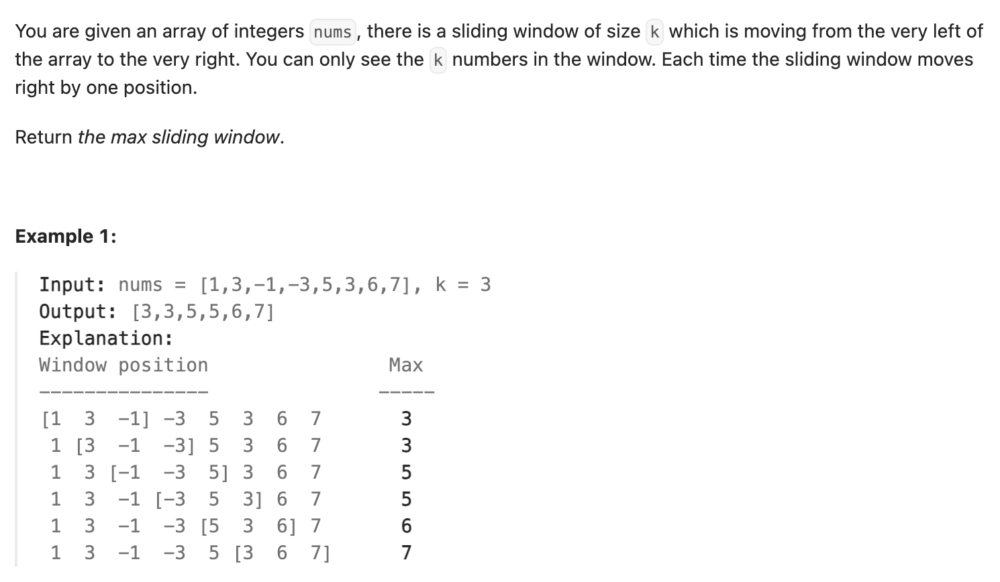

``` cpp
class Solution {
public:
    vector<int> maxSlidingWindow(vector<int>& nums, int k) {
        vector<int> result;
        // 如果i<j且nums[i]<nums[j]，一旦扫描到j就不可能再用到i
        // 把下标存入q，下标单调递增，内容单调递减
        deque<int> q;

        // 存前k个数
        for (int i = 0; i < k; i++) {
            while (!q.empty() && nums[i] > nums[q.back()]) {
                q.pop_back();
            }
            q.push_back(i);
        }

        result.push_back(nums[q.front()]);
        cout << result[0] << endl;

        int left = 1;
        int right = k;

        while (right < nums.size()) {
            // 如果最大数不在窗口了，删除
            if (left - 1 == q.front()) {
                q.pop_front();
            }
            // 保证q内下标递增，数值递减
            while (!q.empty() && nums[right] > nums[q.back()]) {
                q.pop_back();
            }
            q.push_back(right);
            result.push_back(nums[q.front()]);
            left++;
            right++;
        }

        return result;

    }
};
```
