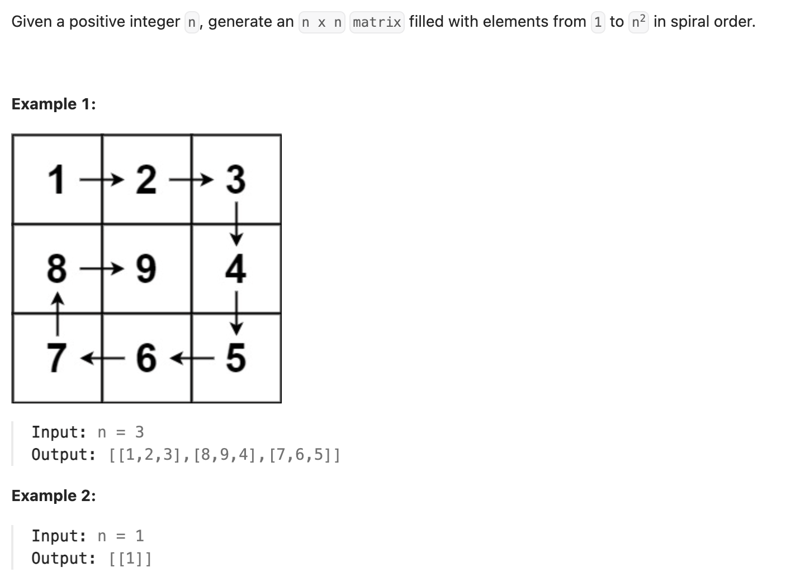

``` cpp
class Solution {
public:
    vector<vector<int>> generateMatrix(int n) {
        // 模拟直接做
        vector<vector<int>> result(n, vector<int>(n, 0));
        int circle = 0;
        int row = 0;
        int col = 0;

        for (int i = 1; i <= n * n; i++) {
            result[row][col] = i;
            // 分析四个角怎么转弯
            if (row == circle + 1 && col == circle) {
                col++;
                circle++;
            } else if (row == circle && col == n - circle - 1) {
                row++;
            } else if (row == n - circle - 1 && col == n - circle - 1) {
                col--;
            } else if (row == n - circle - 1 && col == circle) {
                row--;
            }
            // 分析如果不在角上怎么移动
            else if (row == circle) {
                col++;
            } else if (col == n - circle - 1) {
                row++;
            } else if (row == n - circle - 1) {
                col--;
            } else if (col == circle) {
                row--;
            }
        }

        return result;
    }
};
```
