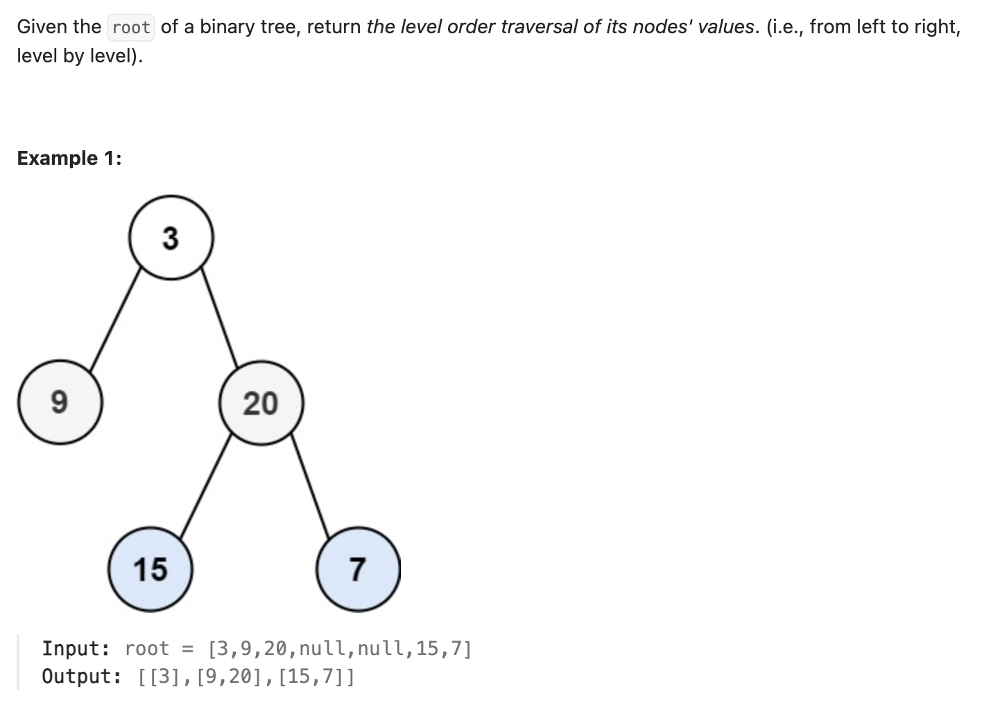

``` cpp
/**
 * Definition for a binary tree node.
 * struct TreeNode {
 *     int val;
 *     TreeNode *left;
 *     TreeNode *right;
 *     TreeNode() : val(0), left(nullptr), right(nullptr) {}
 *     TreeNode(int x) : val(x), left(nullptr), right(nullptr) {}
 *     TreeNode(int x, TreeNode *left, TreeNode *right) : val(x), left(left),
 * right(right) {}
 * };
 */
class Solution {
public:
    vector<vector<int>> levelOrder(TreeNode* root) {
        // 广度优先搜索
        // 利用队列来层层迭代
        vector<vector<int>> result;
        queue<TreeNode*> q;

        if (root != nullptr) {
            q.push(root);
        }

        int s = 0;     // 当前层的node个数
        while (!q.empty()) {
            s = q.size();
            vector<int> curLevel;

            for (int i = 0; i < s; i++) {
                TreeNode* cur = q.front();
                curLevel.push_back(cur->val);
                if (cur->left != nullptr) {
                    q.push(cur->left);
                }
                if (cur->right != nullptr) {
                    q.push(cur->right);
                }
                q.pop();
            }
            result.push_back(curLevel);
        }

        return result;
    }
};
```
