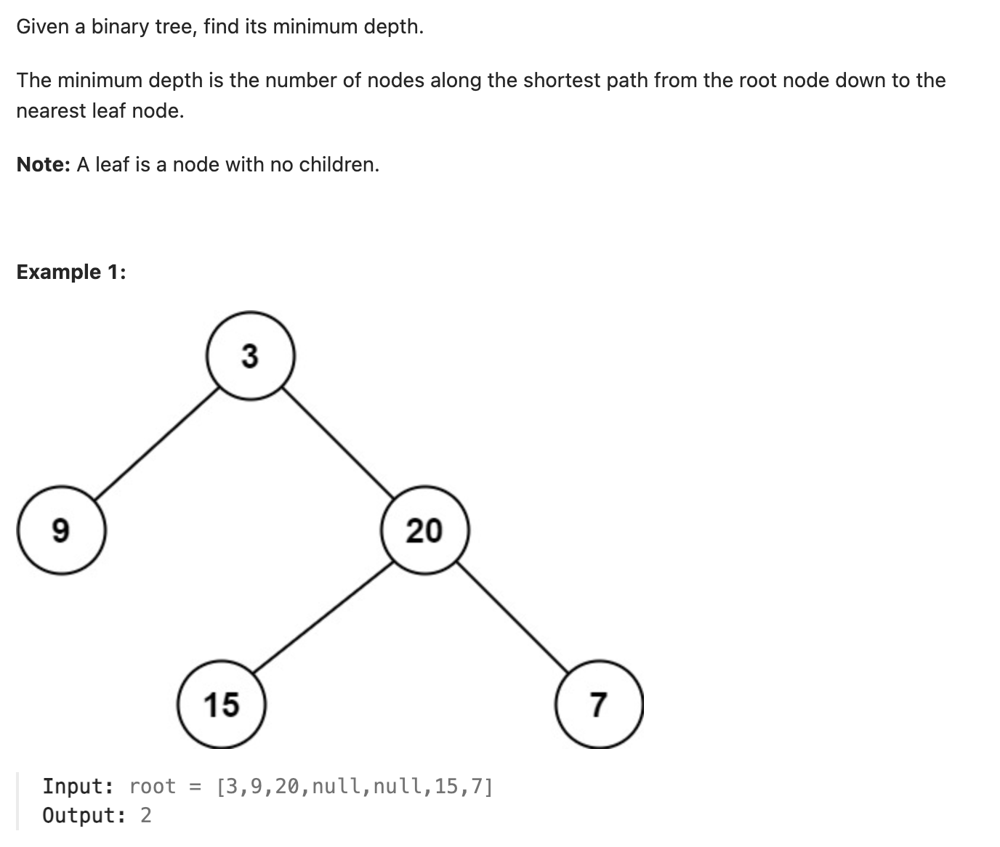

``` cpp
/**
 * Definition for a binary tree node.
 * struct TreeNode {
 *     int val;
 *     TreeNode *left;
 *     TreeNode *right;
 *     TreeNode() : val(0), left(nullptr), right(nullptr) {}
 *     TreeNode(int x) : val(x), left(nullptr), right(nullptr) {}
 *     TreeNode(int x, TreeNode *left, TreeNode *right) : val(x), left(left), right(right) {}
 * };
 */
class Solution {
public:
    int minDepth(TreeNode* root) {
        // 找到第一个没有子树的节点就好
        // 可以利用层序遍历

        if (root == nullptr) {
            return 0;
        }

        queue<TreeNode*> q;
        q.push(root);
        int curLevel = 1;
        int level = 1;

        while(!q.empty()) {
            for (int i = 1; i <= curLevel; i++) {
                TreeNode* cur = q.front();
                q.pop();
                if (cur->left == nullptr && cur->right == nullptr) {
                    return level;
                }
                if (cur->left != nullptr) {
                    q.push(cur->left);
                }
                if (cur->right != nullptr) {
                    q.push(cur->right);
                }
            }
            curLevel = q.size();
            level++;
        }

        return level;
    }
};
```
