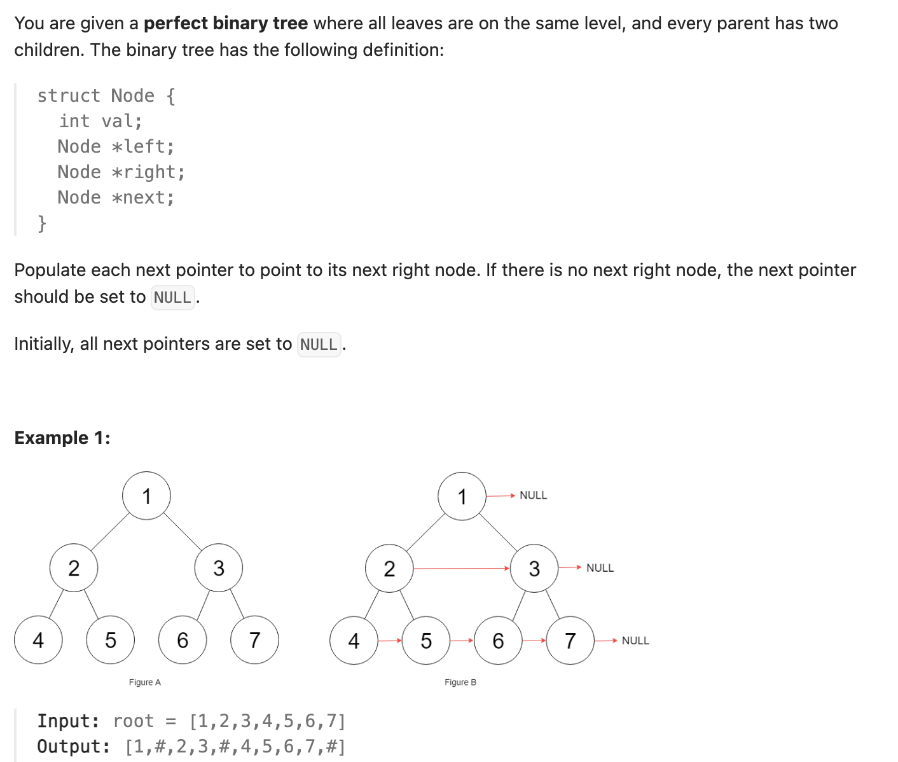

``` cpp
/*
// Definition for a Node.
class Node {
public:
    int val;
    Node* left;
    Node* right;
    Node* next;

    Node() : val(0), left(NULL), right(NULL), next(NULL) {}

    Node(int _val) : val(_val), left(NULL), right(NULL), next(NULL) {}

    Node(int _val, Node* _left, Node* _right, Node* _next)
        : val(_val), left(_left), right(_right), next(_next) {}
};
*/

class Solution {
public:
    Node* connect(Node* root) {
        if (root == nullptr) {
            return nullptr;
        }

        queue<Node*> q; // 同样的，利用queue层序遍历
        int level = 1;
        q.push(root);

        while (!q.empty()) {
            for (int i = 1; i <= level; i++) {
                Node* cur = q.front();
                q.pop();
                if (cur->left != nullptr) {
                    q.push(cur->left);
                }
                if (cur->right != nullptr) {
                    q.push(cur->right);
                }

                if (i == level) {
                    cur->next = nullptr;
                } else {
                    cur->next = q.front();
                }
            }
            level = q.size();
        }

        return root;
    }
};
```

