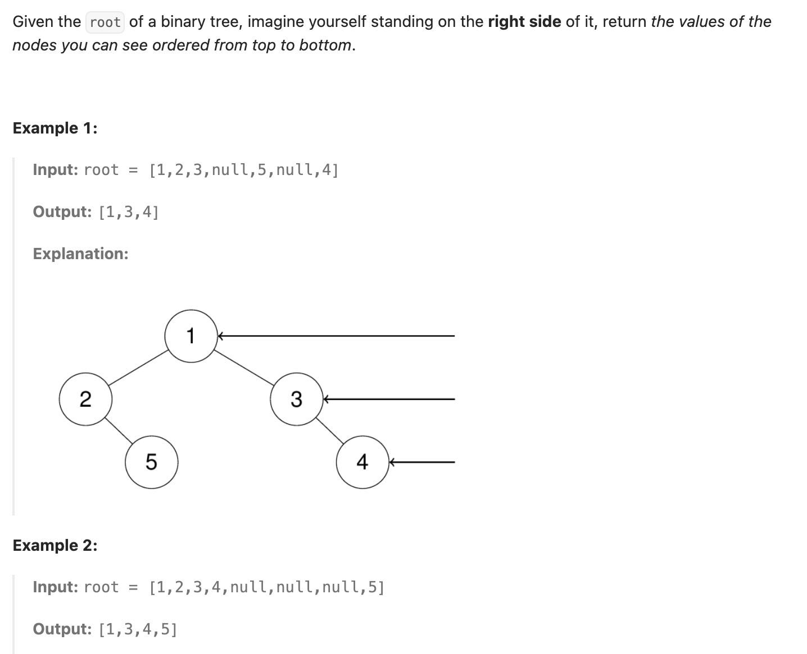

``` cpp
/**
 * Definition for a binary tree node.
 * struct TreeNode {
 *     int val;
 *     TreeNode *left;
 *     TreeNode *right;
 *     TreeNode() : val(0), left(nullptr), right(nullptr) {}
 *     TreeNode(int x) : val(x), left(nullptr), right(nullptr) {}
 *     TreeNode(int x, TreeNode *left, TreeNode *right) : val(x), left(left),
 * right(right) {}
 * };
 */
class Solution {
public:
    vector<int> rightSideView(TreeNode* root) {
        // 使用层次遍历的思路，每次找到最右边的节点
        queue<TreeNode*> q;
        vector<int> result;

        if (root == nullptr) {
            return result;
        }
        q.push(root);
        int cur = 1;

        while (!q.empty()) {
            int next = 0;
            for (int i = 0; i < cur - 1; i++) {
                TreeNode* n = q.front();
                if (n->left != nullptr) {
                    q.push(n->left);
                    next++;
                }
                if (n->right != nullptr) {
                    q.push(n->right);
                    next++;
                }
                q.pop();
            }
            TreeNode* m = q.front();
            result.push_back(m->val);
            if (m->left != nullptr) {
                q.push(m->left);
                next++;
            }
            if (m->right != nullptr) {
                q.push(m->right);
                next++;
            }
            q.pop();
            cur = next;
        }

        return result;
    }
};
```
 