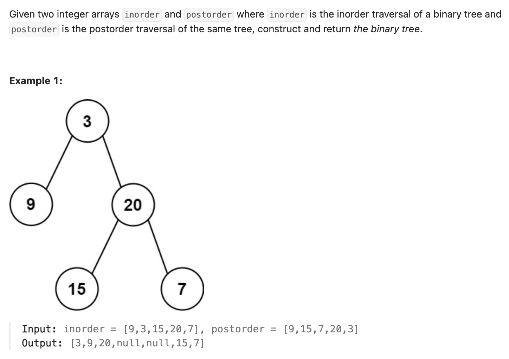

``` cpp
/**
 * Definition for a binary tree node.
 * struct TreeNode {
 *     int val;
 *     TreeNode *left;
 *     TreeNode *right;
 *     TreeNode() : val(0), left(nullptr), right(nullptr) {}
 *     TreeNode(int x) : val(x), left(nullptr), right(nullptr) {}
 *     TreeNode(int x, TreeNode *left, TreeNode *right) : val(x), left(left),
 * right(right) {}
 * };
 */
class Solution {
private:
    // 存现在用完的postorder，最后一个是当前的根节点
    int post_index;
    // 存inorder数字对应的index
    unordered_map<int, int> mp;

public:
    TreeNode* buildTree(vector<int>& inorder, vector<int>& postorder) {
        post_index = (int)size(postorder) - 1;
        for (int i = 0; i < inorder.size(); i++) {
            mp[inorder[i]] = i;
        }
        return helper(0, (int)inorder.size() - 1, inorder, postorder);
    }

    TreeNode* helper(int in_left, int in_right, vector<int>& inorder,
                     vector<int>& postorder) {
        if (in_left > in_right) {
            return nullptr;
        }
        TreeNode* root = new TreeNode(postorder[post_index]);
        post_index--;

        // 先右边后左边，确保postorder判断根节点的正确性
        root->right = helper(mp[root->val] + 1, in_right, inorder, postorder);
        root->left = helper(in_left, mp[root->val] - 1, inorder, postorder);

        return root;
    }
};
```