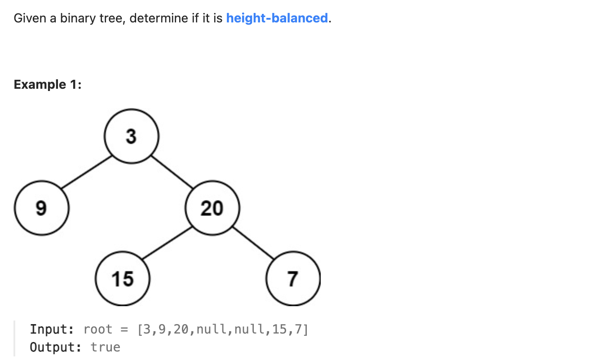

``` cpp
/**
 * Definition for a binary tree node.
 * struct TreeNode {
 *     int val;
 *     TreeNode *left;
 *     TreeNode *right;
 *     TreeNode() : val(0), left(nullptr), right(nullptr) {}
 *     TreeNode(int x) : val(x), left(nullptr), right(nullptr) {}
 *     TreeNode(int x, TreeNode *left, TreeNode *right) : val(x), left(left), right(right) {}
 * };
 */
class Solution {
public:
    bool isBalanced(TreeNode* root) {
        //  看看是不是-1
        return height(root) >= 0;
    }

    // 子树不平衡，则这棵树不平衡
    // 计算高度的同时顺便传递是不是平衡的信息
    // 如果已经不平衡了，传-1，否则传递高度
    int height(TreeNode* root) {
        if (root == nullptr) {
            return 0;
        }
        
        int left = height(root->left);
        int right = height(root->right);

        if (left == -1 || right == -1 || abs(left - right) > 1) {
            return -1;
        }

        return max(left, right) + 1;
    }
};
```
