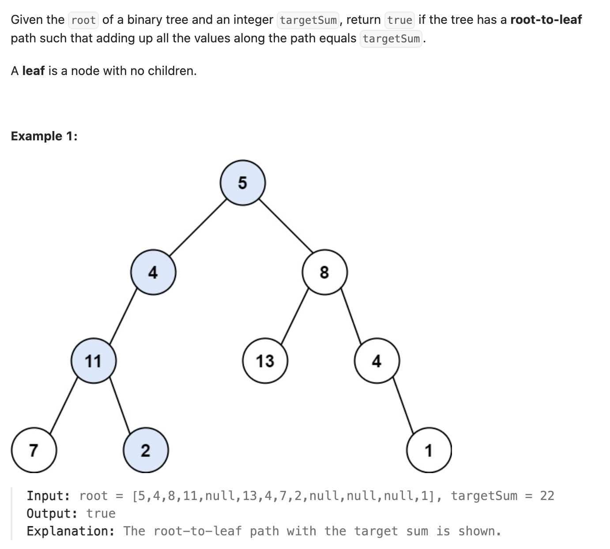

``` cpp
/**
 * Definition for a binary tree node.
 * struct TreeNode {
 *     int val;
 *     TreeNode *left;
 *     TreeNode *right;
 *     TreeNode() : val(0), left(nullptr), right(nullptr) {}
 *     TreeNode(int x) : val(x), left(nullptr), right(nullptr) {}
 *     TreeNode(int x, TreeNode *left, TreeNode *right) : val(x), left(left), right(right) {}
 * };
 */
class Solution {
public:
    bool hasPathSum(TreeNode* root, int targetSum) {
        bool result = false;
        dfs(root, result, 0, targetSum);
        return result;
    }

    void dfs(TreeNode* root, bool& result, int curSum, int targetSum) {
        if (root == nullptr || result == true) {
            return;
        }

        curSum += root->val;

        if (root->left == nullptr && root->right == nullptr) {
            if (curSum == targetSum) {
                result = true;
            }
            return;
        }
        
        dfs(root->left, result, curSum, targetSum);
        dfs(root->right, result, curSum, targetSum);
    }
};
```
