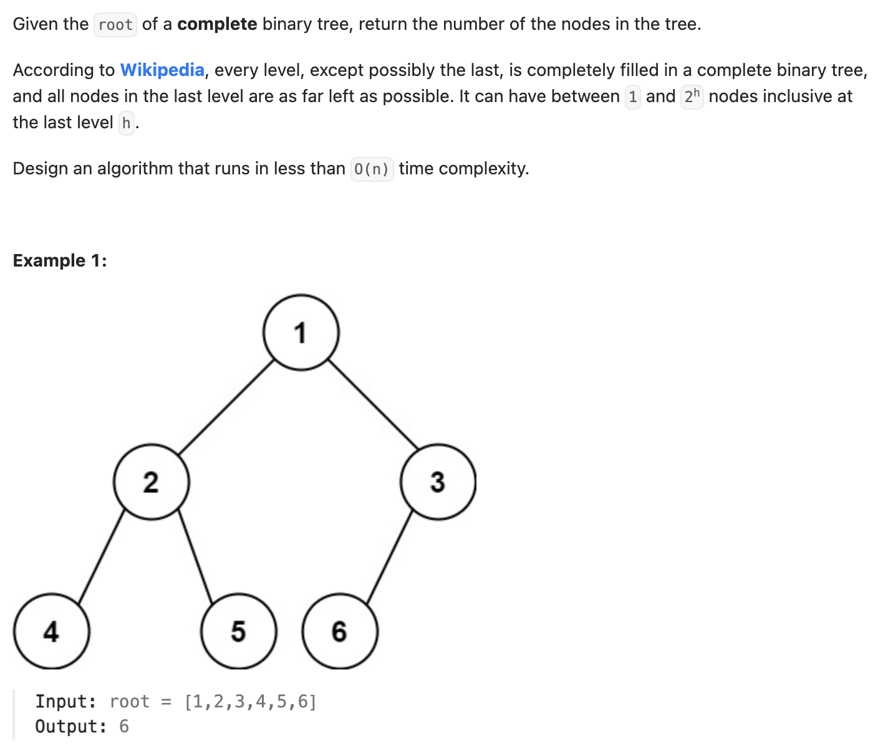

``` cpp
/**
 * Definition for a binary tree node.
 * struct TreeNode {
 *     int val;
 *     TreeNode *left;
 *     TreeNode *right;
 *     TreeNode() : val(0), left(nullptr), right(nullptr) {}
 *     TreeNode(int x) : val(x), left(nullptr), right(nullptr) {}
 *     TreeNode(int x, TreeNode *left, TreeNode *right) : val(x), left(left), right(right) {}
 * };
 */
class Solution {
public:
    int countNodes(TreeNode* root) {
        // 判断左右子树是不是满二叉树
        if (root == nullptr) {
            return 0;
        }
        TreeNode* left = root->left;
        TreeNode* right = root->right;

        // 看一路向左走和一路向右走层数是否一致，如果一致一定是满二叉树
        int leftDepth = 0;
        int rightDepth = 0;
        while (left != nullptr) {
            leftDepth++;
            left = left->left;
        }
        while(right != nullptr) {
            rightDepth++;
            right = right->right;
        }

        // 是满二叉树，直接加上
        if (leftDepth == rightDepth) {
            // 注意层数没算上root，要加上
            return pow(2, leftDepth + 1) - 1;
        }

        // 不是满二叉树，继续找是满二叉树的子树
        return countNodes(root->left) + countNodes(root->right) + 1;
    }
};
```