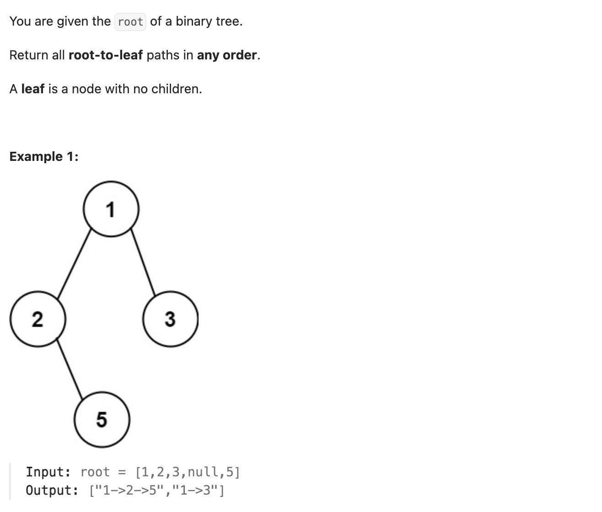

``` cpp
/**
 * Definition for a binary tree node.
 * struct TreeNode {
 *     int val;
 *     TreeNode *left;
 *     TreeNode *right;
 *     TreeNode() : val(0), left(nullptr), right(nullptr) {}
 *     TreeNode(int x) : val(x), left(nullptr), right(nullptr) {}
 *     TreeNode(int x, TreeNode *left, TreeNode *right) : val(x), left(left), right(right) {}
 * };
 */
class Solution {
public:
    vector<string> binaryTreePaths(TreeNode* root) {
        vector<string> result;
        constructPaths(root,"",result);
        return result;

    }

    void constructPaths(TreeNode* root, string path, vector<string>& paths) {
        // 如果是最后一位，加进去即可
        if (root->left == nullptr && root->right == nullptr) {
            path += to_string(root->val);
            paths.push_back(path);
        }

        // 如果不是最后一位，左右递归
        path += to_string(root->val);
        path += "->";

        if (root->left != nullptr) {
            constructPaths(root->left, path, paths);
        }

        if (root->right != nullptr) {
            constructPaths(root->right, path, paths);
        }
    }
};
```
