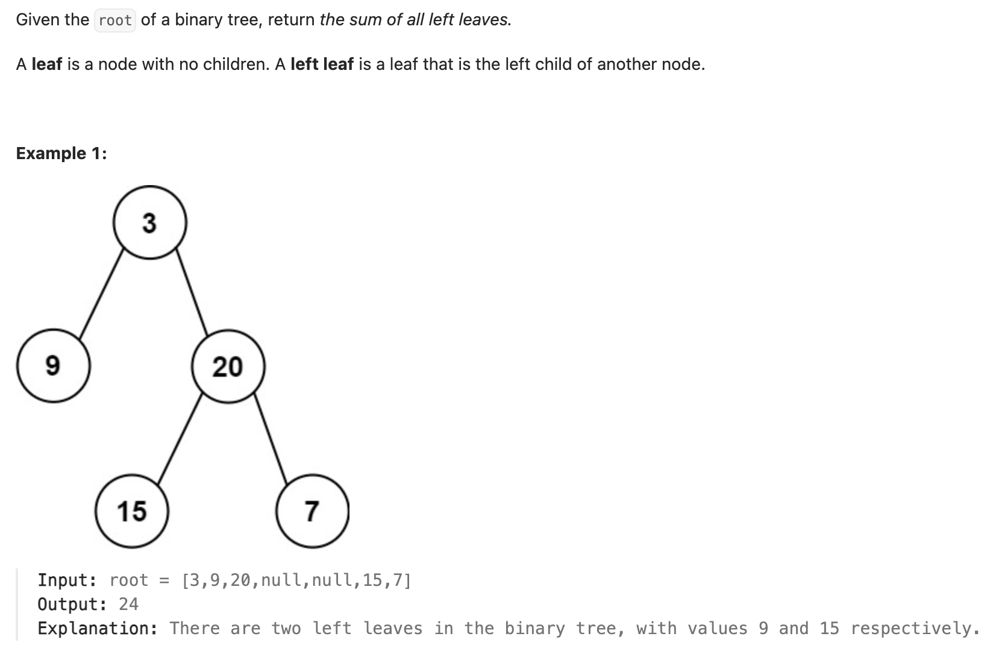

``` cpp
/**
 * Definition for a binary tree node.
 * struct TreeNode {
 *     int val;
 *     TreeNode *left;
 *     TreeNode *right;
 *     TreeNode() : val(0), left(nullptr), right(nullptr) {}
 *     TreeNode(int x) : val(x), left(nullptr), right(nullptr) {}
 *     TreeNode(int x, TreeNode *left, TreeNode *right) : val(x), left(left), right(right) {}
 * };
 */
class Solution {
public:
    int sumOfLeftLeaves(TreeNode* root) {
        int sum = 0;

        // 如果找到了合适的左叶子，加上
        if (root->left != nullptr) {
            TreeNode* left = root->left;
            if (left->left == nullptr && left->right == nullptr) {
                sum += left->val;
            }
            else {
                // 继续递归
                sum = sum + sumOfLeftLeaves(root->left);
            }
        }

        // 继续递归
        if (root->right != nullptr) {
            sum += sumOfLeftLeaves(root->right);
        }

        return sum;
    }
};
```