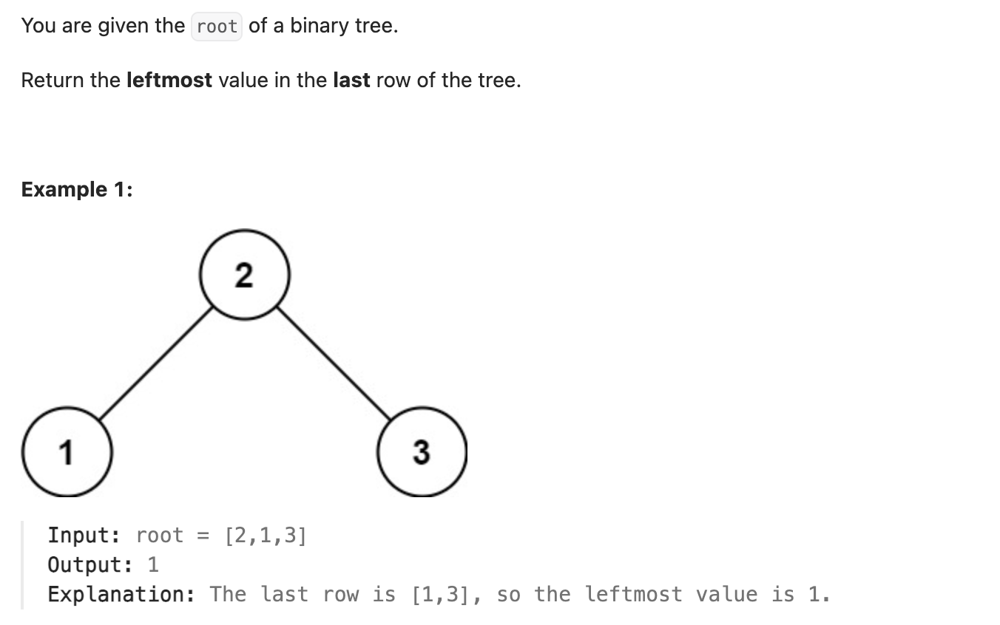

``` cpp
/**
 * Definition for a binary tree node.
 * struct TreeNode {
 *     int val;
 *     TreeNode *left;
 *     TreeNode *right;
 *     TreeNode() : val(0), left(nullptr), right(nullptr) {}
 *     TreeNode(int x) : val(x), left(nullptr), right(nullptr) {}
 *     TreeNode(int x, TreeNode *left, TreeNode *right) : val(x), left(left), right(right) {}
 * };
 */
class Solution {
public:
    int findBottomLeftValue(TreeNode* root) {
       // 可以用层序遍历，从右往左遍历，最后得到的就是最底层最左边的值
       // 这里展示用dfs的方法
       int curValue = root->val;
       int curHeight = 0;
       dfs(root, 0, curValue, curHeight);
       return curValue;
    }

    // height 记录遍历到的节点的高度，curValue 记录高度在 curHeight 的最左节点的值
    void dfs (TreeNode* root, int height, int& curValue, int& curHeight) {
        if (root == nullptr) {
            return;
        }
        
        height++;
        // 每个节点，先往左下去，再往右下去，找到底。确保一定先找到的是最左边的
        dfs(root->left, height, curValue, curHeight);
        dfs(root->right, height, curValue, curHeight);

        if (height > curHeight) {
            curHeight = height;
            curValue = root->val;
        }
    }
    
};
```
