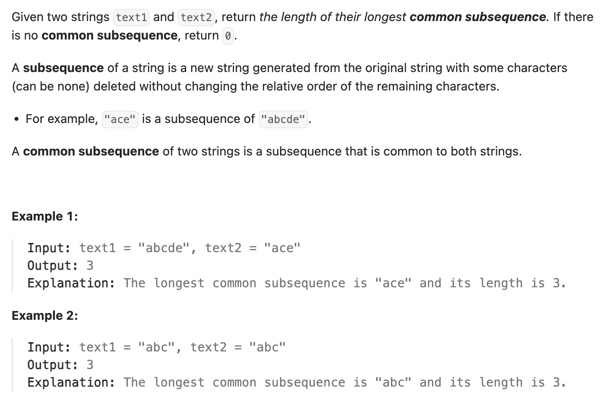

``` cpp
class Solution {
public:
    int longestCommonSubsequence(string text1, string text2) {
        // dp[i][j]表示到text1到第i位和text2到第j位的最长共同子序列
        vector<vector<int>> dp(text1.size() + 1, vector<int>(text2.size() + 1, 0));
        
        // 初始条件：d[i][0] = d[0][j] = 0

        for (int i = 1; i <= text1.size(); i++) {
            for (int j = 1; j <= text2.size(); j++) {
                // 如果这一位相等，那么dp[i][j] = dp[i-1][j-1] + 1
                // 注意，虽然是第i和第j位，对text1和text2来说是i-1和j-1
                if (text1[i - 1] == text2[j - 1]) {
                    dp[i][j] = dp[i-1][j-1] + 1;
                }
                // 如果不相等，取dp[i][j-1]和dp[i-1][j]里面大的那个
                else {
                    dp[i][j] = max(dp[i][j-1], dp[i-1][j]);
                }
            }
        }

        return dp[text1.size()][text2.size()];
    }
};
```
