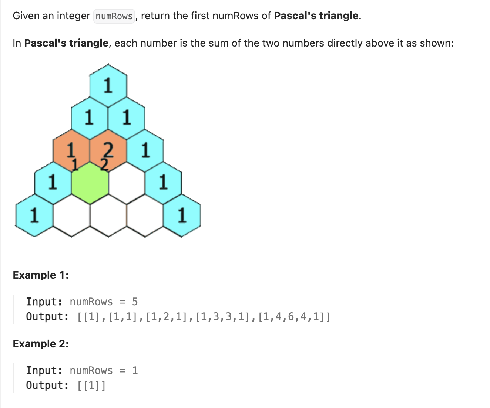

``` cpp
class Solution {
public:
    vector<vector<int>> generate(int numRows) {
        vector<vector<int>> res(numRows);
        for (int i = 0; i < numRows; i++) {
            for (int j = 0; j <= i; j++) {
                // 两边放1
                if (j == 0 || j == i) {
                    res[i].push_back(1);
                }
                // 中间放加起来的
                else {
                    res[i].push_back(res[i - 1][j - 1] + res[i - 1][j]);
                }
            }
        }
        return res;
    }
};
```
