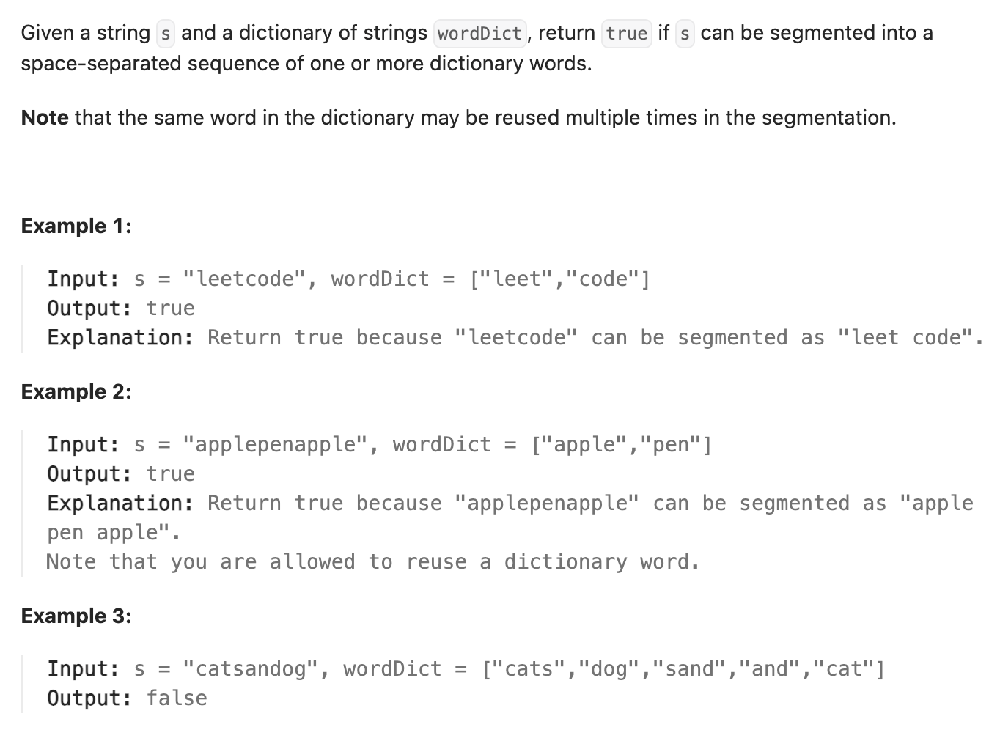

``` cpp
class Solution {
public:
    bool wordBreak(string s, vector<string>& wordDict) {
        // dp[i]：字符串s前i个字符组成的字符串能否被拆分
        // i从小到大取到s.size()，每一步的判断需要借助j,j是0到i-1
        // dp[i]=dp[j] && check(s[j..i−1])

        // 把字典存入哈希表中
        unordered_set<string> word_set;
        for (auto x : wordDict) {
            word_set.insert(x);
        }

        vector<bool> dp(s.size() + 1);
        dp[0] = true;
        for (int i = 1; i <= s.size(); i++) {
            for (int j = 0; j < i; j++) {
                // 注意substr的参数是（位置，长度）！！！
                if (dp[j] &&
                    word_set.find(s.substr(j, i - j)) != word_set.end()) {
                        dp[i] = true;
                        break;
                }
            }
        }
        return dp[s.size()];
    }
};
```
