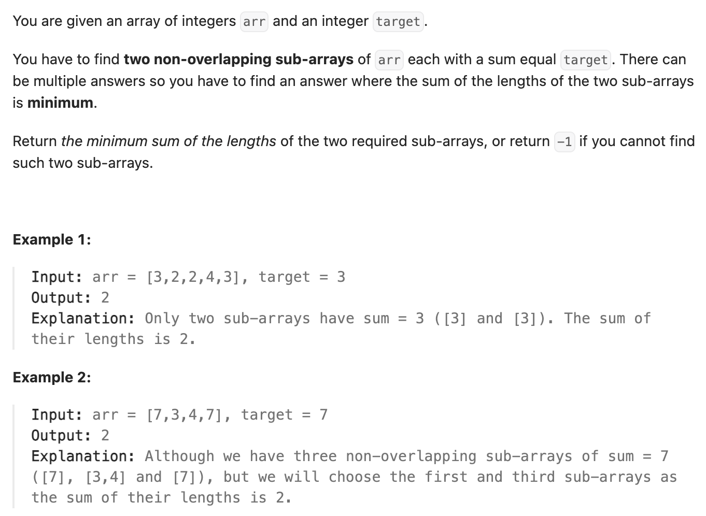

前缀和+哈希+动态规划
``` cpp
class Solution {
public:
    int minSumOfLengths(vector<int>& arr, int target) {
        // 前缀和：用于找到和为target的子数组。
        unordered_map<int, int> mp; // 用来查找能达到target的可能性
        mp[0] = -1;

        vector<int> dp(arr.size(), INT_MAX); // 用两次，前缀和&动态规划

        int currSum = 0;

        // dp[j]，到0-j位里和为target的数组最短是多长
        // 每遇到一个新的符合target的结果，就可以检测两子串之和是不是最小的
        int currMin = INT_MAX;
        int result = INT_MAX;

        for (int b = 0; b < arr.size(); b++) {
            currSum += arr[b]; // 0-b前缀和
            mp[currSum] = b;
            if (mp.find(currSum - target) != mp.end()) {
                int a = mp[currSum - target];
                currMin = min(currMin, b - a); // 当前子数组为a+1,b
                if (a >= 0 && dp[a] != INT_MAX) {
                    result = min(result, b - a + dp[a]);
                }
            }
            dp[b] = currMin;
        }

        if (result != INT_MAX) {
            return result;
        } else {
            return -1;
        }
    }
};
```

双指针+动态规划
``` cpp
class Solution {
public:
    int minSumOfLengths(vector<int>& arr, int target) {
        vector<int> dp(arr.size(), INT_MAX); // 动态规划

        int left = 0;
        int currSum = 0;

        // dp[j]，到0-j位里和为target的数组最短是多长
        // 每遇到一个新的符合target的结果，就可以检测两子串之和是不是最小的
        int currMin = INT_MAX;
        int result = INT_MAX;

        for (int right = 0; right < arr.size(); right++) {
            currSum += arr[right];
            while (currSum > target) {
                currSum -= arr[left];
                left++;
            }

            if (currSum == target) {
                currMin = min(currMin, right - left + 1); // 当前子数组为a+1,b
                if (left > 0 && dp[left - 1] != INT_MAX) {
                    result = min(result, right - left + 1 + dp[left - 1]);
                }
            }
            dp[right] = currMin;
        }

        if (result != INT_MAX) {
            return result;
        } else {
            return -1;
        }
    }
};
```