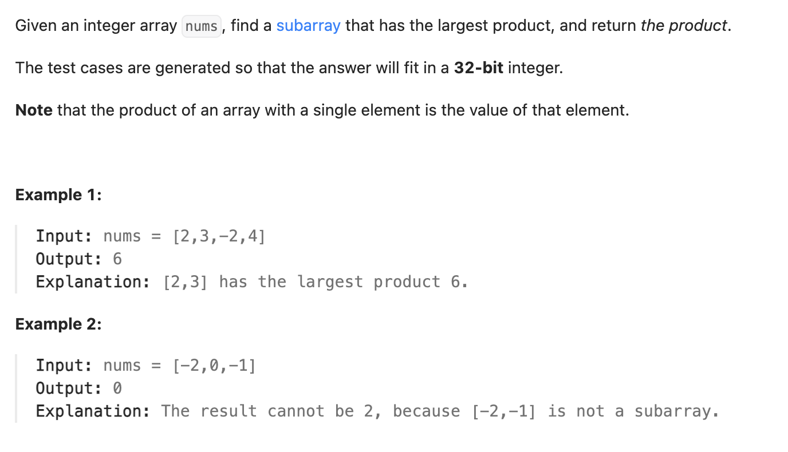

``` cpp
class Solution {
public:
    int maxProduct(vector<int>& nums) {
        // 需要存前面最大的正乘积和最小的负乘积，存在一个数组的pair里。
        // f_max(i) = max(f_max(i-1)*a_i, f_min(i-1)*a_i, a_i)
        // f_min(i) = min(f_max(i-1)*a_i, f_min(i-1)*a_i, a_i)

        vector<pair<int,int>> mp(nums.size());
        mp[0].first = nums[0];
        mp[0].second = nums[0];
        int res = nums[0];

        for(int i=1;i<nums.size();i++){
            // 这三个里选两个作为最大和最小。
            int a = mp[i-1].first*nums[i];
            int b = mp[i-1].second*nums[i];
            int c = nums[i];

            mp[i].first = max(a,max(b,c));
            mp[i].second = min(a,min(b,c));

            // 查看当前最大值
            res = max(res,mp[i].first);
        }

        return res;
    }
};

// 另外，其实不用数组，只用单个变量记前面的最大和最小乘积就可以了。
```
