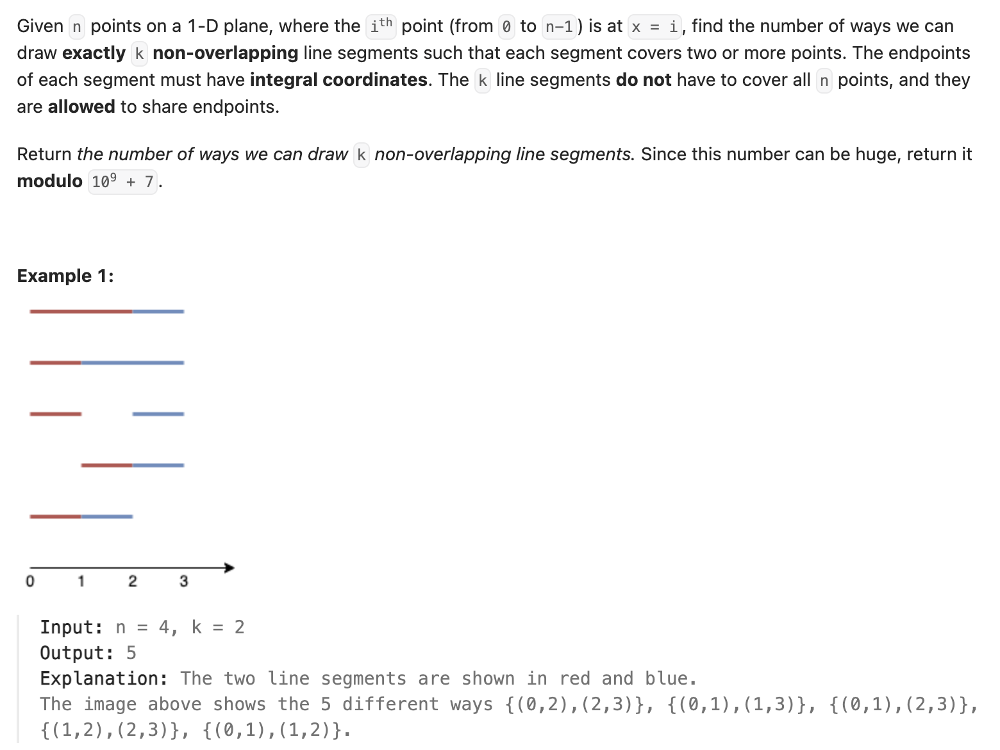

``` cpp
const int MOD = 1000000007;

class Solution {
public:
    int numberOfSets(int n, int k) {
        // dp[i][j]: 使用前 j 个点构造 i 条线段的合法方案数
        vector<vector<int>> dp(k + 1, vector<int>(n + 1, 0));

        // prefix[i][j]: dp[i][1] + ... + dp[i][j]
        vector<vector<long long>> prefix(k + 1, vector<long long>(n + 1, 0));

        // 0 条线段永远只有一种方案：什么都不选
        for (int j = 0; j <= n; j++) {
            dp[0][j] = 1;
        }

        for (int j = 1; j <= n; j++) {
            prefix[0][j] = (prefix[0][j - 1] + dp[0][j]) % MOD;
        }

        for (int i = 1; i <= k; i++) {
            for (int j = 1; j <= n; j++) {
                // 不以第j个点作为右端点
                dp[i][j] = dp[i][j - 1];

                // 以第j个点作为右端点
                if (j >= 2) {
                    dp[i][j] += prefix[i - 1][j - 1];
                    dp[i][j] %= MOD;
                }
                prefix[i][j] = (prefix[i][j - 1] + dp[i][j]) % MOD;
            }
        }

        return dp[k][n];

    }
};
```
