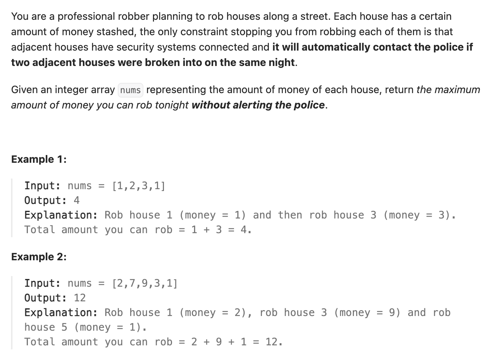

``` cpp
class Solution {
public:
    int rob(vector<int>& nums) {
        // dp[i] = max(dp[i-2] , dp[i-3]) + nums[i]
        int len = nums.size();
        // 初始状态
        if (len == 1) {return nums[0];}
        if (len == 2) {return max(nums[0], nums[1]);}
        if (len == 3) {return max(nums[0] + nums[2], nums[1]);}

        // 从第四家开始
        vector<int> dp(len);
        dp[0] = nums[0];
        dp[1] = max(nums[0], nums[1]);
        dp[2] = max(nums[0] + nums[2], nums[1]);
        int res = dp[2];
        for (int i = 3; i < len; i++) {
            dp[i] = max(dp[i - 2], dp[i - 3]) + nums[i];
            res = max(res, dp[i]);
        }
        return res;
    }
};
```
