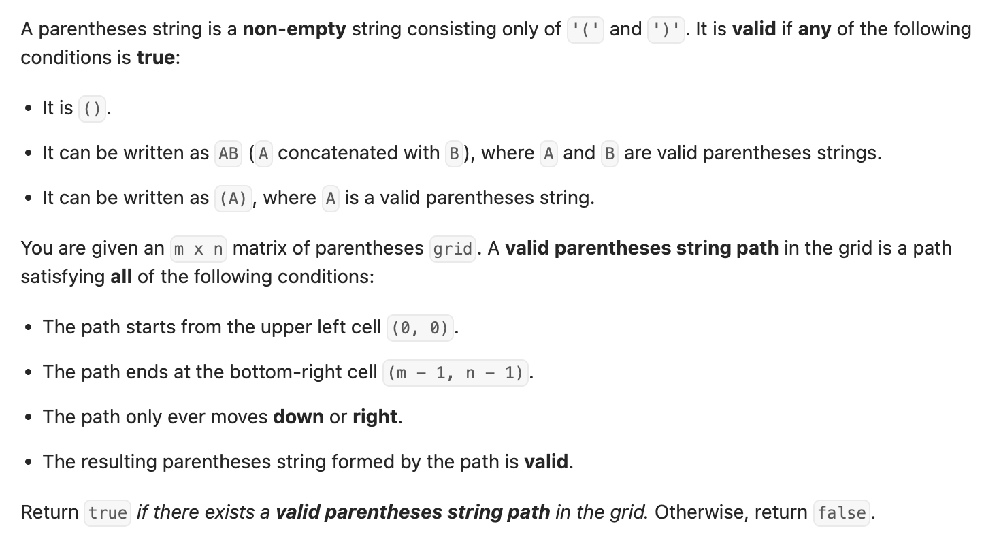

``` cpp
class Solution {
public:
    bool hasValidPath(vector<vector<char>>& grid) {
        // dp[i][j][k]：从左上角走到第i行第j列可能出现的未匹配的左括号数量集合(k指左括号个数)
        // "whether we can reach (i, j) with balance k"

        int n = grid.size();
        int m = grid[0].size();
        int pathLen = n + m - 1;

        // 如果长度为奇数，必不可能
        if (pathLen % 2 == 1) {
            return false;
        }

        if (grid[0][0] == ')' || grid[n - 1][m - 1] == '(') {
            return false;
        }

        vector<vector<vector<bool>>> dp(
            n, vector<vector<bool>>(m, vector<bool>(pathLen + 1, false)));

        // 初始化开头
        dp[0][0][1] = true;

        for (int i = 0; i < n; i++) {
            for (int j = 0; j < m; j++) {
                if (i == 0 && j == 0) {
                    continue;
                }

                for (int k = 0; k <= pathLen; k++) {
                    // 来自上面
                    if (i > 0 && dp[i - 1][j][k]) {
                        if (grid[i][j] == '(') {
                            if (k + 1 <= pathLen) {
                                dp[i][j][k + 1] = true;
                            }
                        } else {
                            if (k > 0) {
                                dp[i][j][k - 1] = true;
                            }
                        }
                    }

                    // 来自左边
                    if (j > 0 && dp[i][j - 1][k]) {
                        if (grid[i][j] == '(') {
                            if (k + 1 <= pathLen) {
                                dp[i][j][k + 1] = true;
                            }
                        } else {
                            if (k > 0) {
                                dp[i][j][k - 1] = true;
                            }
                        }
                    }
                }
            }
        }

        return dp[n - 1][m - 1][0];
    }
};
```
