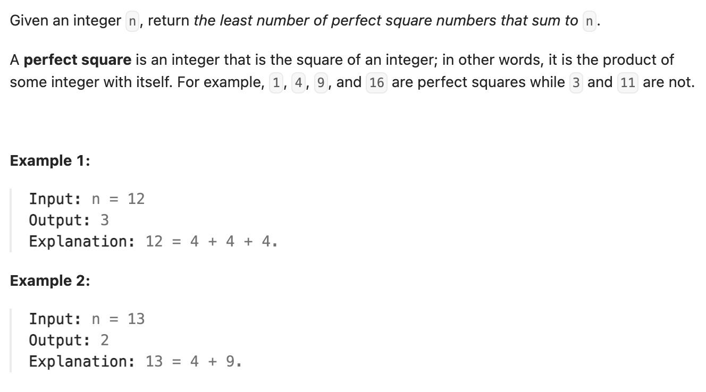

#### 方法一：动态规划
``` cpp
class Solution {
public:
    int numSquares(int n) {
        // dp[i] = min(dp[i-j^2]) + 1
        vector<int> dp(n + 1);
        dp[0] = 0;

        // 记录每一位的最小值
        for (int i = 1; i <= n; i++) {
            dp[i] = i;
            for (int j = 1; i - j * j >= 0; j++) {
                dp[i] = min(dp[i], dp[i - j * j] + 1);
            }
        }
        return dp[n];
    }
};
```

#### 方法二：数学
``` cpp
class Solution {
public:
    int numSquares(int n) {
        // 数学 - 「四平方和定理」
        // 四平方和定理证明了任意一个正整数都可以被表示为至多四个正整数的平方和
        // 当 n = 4^k * (8m+7)时，n 只能被表示为四个正整数的平方和。
        if (is_perfect_square(n)) {
            return 1;
        }
        if (check_answer_4(n)) {
            return 4;
        }
        for (int i = 1; n - i * i >= 0; i++) {
            if (is_perfect_square(n - i * i)) {
                return 2;
            }
        }
        return 3;
    }

    // 辅助函数：判断是否为完全平方数
    bool is_perfect_square(int x) {
        int y = sqrt(x);
        return x == y * y;
    }

    // 辅助函数：判断是否n = 4^k * (8m+7)
    bool check_answer_4(int x) {
        while (x % 4 == 0) {
            x /= 4;
        }
        return x % 8 == 7;
    }
};
```
