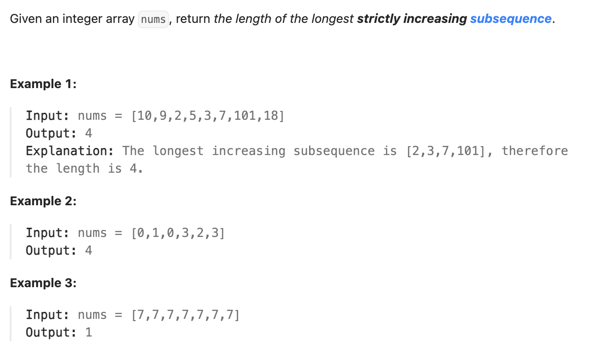

``` cpp
class Solution {
public:
    int lengthOfLIS(vector<int>& nums) {
        // dp[i] 表示如果把第i位放进数列，最长能有多长
        vector<int> dp(nums.size());
        dp[0] = 1;
        // 不断寻找结果
        int res = 1;

        for (int i = 1; i < nums.size(); i++) {
            dp[i] = 1;
            for (int j = 0; j < i; j++) {
                if (nums[i] > nums[j]) {
                    dp[i] = max(dp[i], dp[j] + 1);
                }
            }
            res = max(res, dp[i]);
        }

        return res;
    }
};
```

