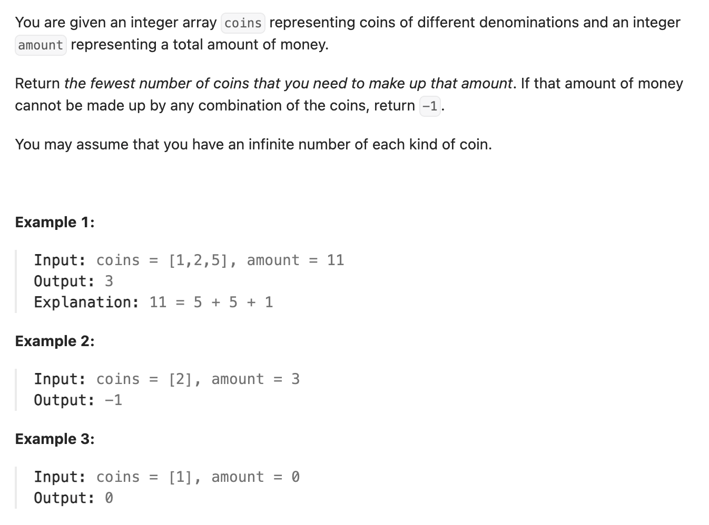

``` cpp
class Solution {
public:
    int coinChange(vector<int>& coins, int amount) {
        // 先全部填为amount+1
        vector<int> dp(amount + 1, amount + 1);
        dp[0] = 0;

        for (int i = 1; i <= amount; i++) {
            for (int j = 0; j < coins.size(); j++) {
                int cur_coin = coins[j];
                // 如果当下状态有解
                if (i - cur_coin >= 0 && dp[i - cur_coin] != amount + 1) {
                    dp[i] = min(dp[i], dp[i - cur_coin] + 1);
                }
            }
        }

        if (dp[amount] == amount + 1) {
            return -1;
        }
        return dp[amount];
    }
};
```
