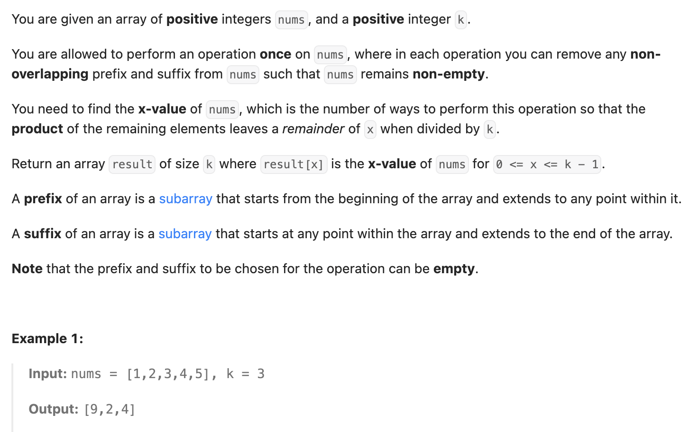

``` cpp
class Solution {
public:
    // 题意：寻找除以k的余数为0~k-1的子数组个数
    vector<long long> resultArray(vector<int>& nums, int k) {
        // dp[i][r]:以i为右端点的子数组中除以k余数为r的个数
        // m = r * nums[i + 1] % k
        // dp[i+1][m] += dp[i][r]

        vector<long long> dp(k, 0); // 滚动数组
        vector<long long> result(k, 0);

        for (int i = 0; i < nums.size(); i++) {
            vector<long long> cur(k, 0);
            // 和前面相乘的余数（余数积得到的余数=原数积得到的余数）
            for (int r = 0; r < k; r++) {
                // 1LL把整个乘法提升为long long类型计算，避免发生int溢出
                long long product = 1LL * r * nums[i];
                int m = product % k;
                cur[m] += dp[r];
            }
            // 自己本身得到的余数
            cur[nums[i] % k]++;

            dp = move(cur); // 更新状态

            for (int r = 0; r < k; r++) {
                result[r] += dp[r];
            }
        }

        return result;
    }
};
```
