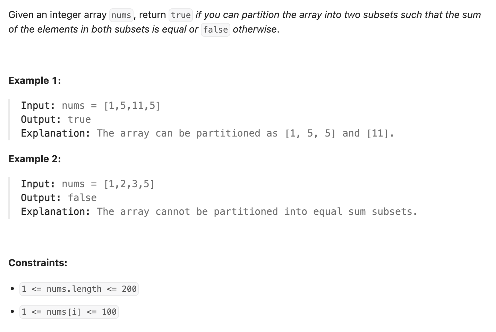

``` cpp
class Solution {
public:
    bool canPartition(vector<int>& nums) {
        // 首先根据和的奇偶，判断存在的可能
        int s = 0;
        for (int i = 0; i < nums.size(); i++) {
            s += nums[i];
        }
        if (s % 2 == 1) {
            return false;
        }
        int target = s / 2;

        // d[i][j]是指，在0-i的数字里，是否存在和为j
        // 若d[i-1][j]==true,d[i][j]=true
        // 若d[i-1][j-nums[i]]==true,d[i][j]=true
        vector<vector<bool>> d(nums.size(), vector<bool>(target + 1, false));

        d[0][0] = true;

        for (int i = 1; i < nums.size(); i++) {
            // 有一个数大于target时，直接结束
            if (nums[i] > target) {
                return false;
            }

            for (int j = 0; j <= target; j++) {
                if (d[i - 1][j] == true) {
                    d[i][j] = true;
                }
                if (j - nums[i] >= 0 && d[i - 1][j - nums[i]] == true) {
                    d[i][j] = true;
                }
            }

            // 找到了，成功了
            if (d[i][target] == true) {
                return true;
            }
        }

        return false;
    }
};
```

还可以用一维数组dp：
``` cpp
class Solution {
public:
    bool canPartition(vector<int>& nums) {
        int sum = 0;

        for (int num : nums) {
            sum += num;
        }

        if (sum % 2 != 0) {
            return false;
        }

        int target = sum / 2;

        vector<bool> dp(target + 1, false);
        dp[0] = true;

        for (int num : nums) {
            if (num > target) {
                return false;
            }
			
			// 注意要从后往前遍历，防止新加入的数字被之后利用
            for (int j = target; j >= num; --j) {
                dp[j] = dp[j] || dp[j - num];
            }

            if (dp[target]) {
                return true;
            }
        }

        return false;
    }
};
```
