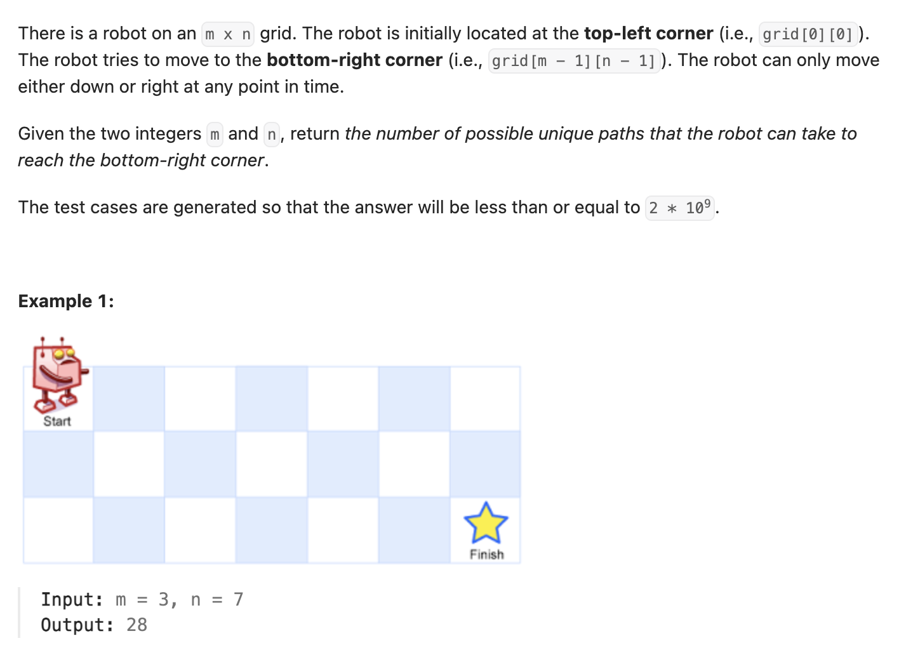

``` cpp
class Solution {
public:
    int uniquePaths(int m, int n) {
        // 初中数学来的，每一格等于左加上
        vector<vector<int>> dp(m, vector<int>(n,1));
        
        for (int i = 1; i < m; i++){
            for (int j = 1; j < n; j++){
                dp[i][j] = dp[i-1][j] + dp[i][j-1];
            }
        }

        return dp[m-1][n-1];
    }
};
```

还可以是一维的，只要保存前一行同位置的数值就可以
``` cpp
class Solution {
public:
    int uniquePaths(int m, int n) {
        // 一维做法
        vector<int> dp(n, 1);

        for(int i = 1; i < m; i++){
            for(int j = 1; j < n; j++){
                // dp[j]   = 上一行的 dp[i-1][j]
                // dp[j-1] = 当前行刚刚算好的 dp[i][j-1]
                dp[j] += dp[j-1];
            }
        }

        return dp[n-1];
    }
};
```

