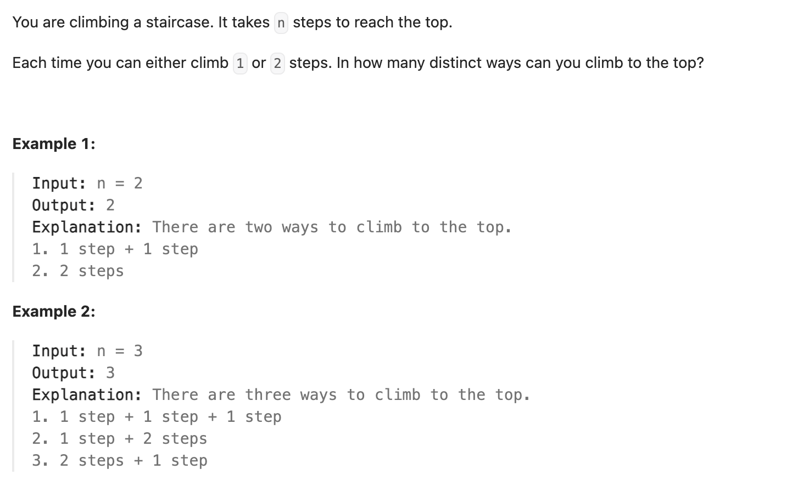

``` cpp
class Solution {
public:
    int climbStairs(int n) {
        // dp[i] = dp[i-1] + dp[i-2]
        // 需要用数组存放，不然一直算，会超时

        vector<int> dp(n + 1);
        // 初始情况
        if (n == 1) {return 1;}
        if (n == 2) {return 2;}

        // 从第三位开始
        dp[1] = 1;
        dp[2] = 2;
        for (int i = 3; i <= n; i++) {
            dp[i] = dp[i - 1] + dp[i - 2];
        }
        return dp[n];
    }
};
```
