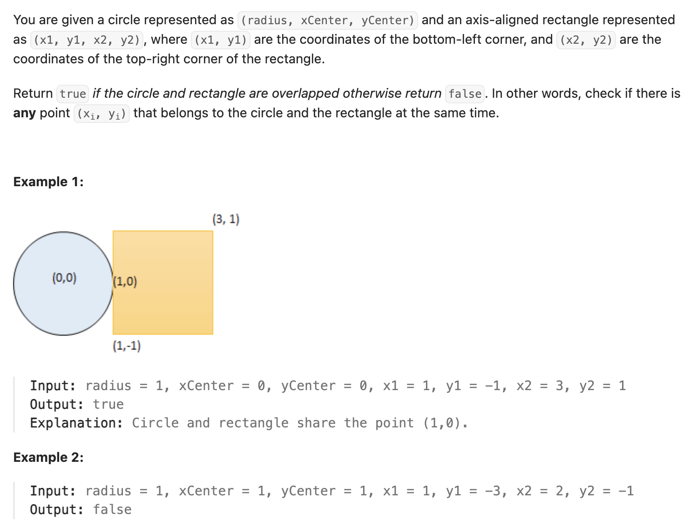

``` cpp
class Solution {
public:
    bool checkOverlap(int radius, int xCenter, int yCenter, int x1, int y1,
                      int x2, int y2) {
        // 求圆心到矩形区域的最短距离
        // 如果圆心x/y在矩形里面，x_min/y_min=0
        // x_min(x) = min{|x-x_1|,|x-x_2|}
        // y_min(y) = min{|y-y_1|,|y-y_2|}

        long long x_min_pow = 0;
        long long y_min_pow = 0;

        if (xCenter < x1 || xCenter > x2) {
            x_min_pow = min(pow(x1 - xCenter, 2), pow(xCenter - x2, 2));
        }

        if (yCenter < y1 || yCenter > y2) {
            y_min_pow = min(pow(y1 - yCenter, 2), pow(yCenter - y2, 2));
        }

        if (x_min_pow + y_min_pow <= pow(radius, 2)) {
            return true;
        } else {
            return false;
        }
    }
};
```
