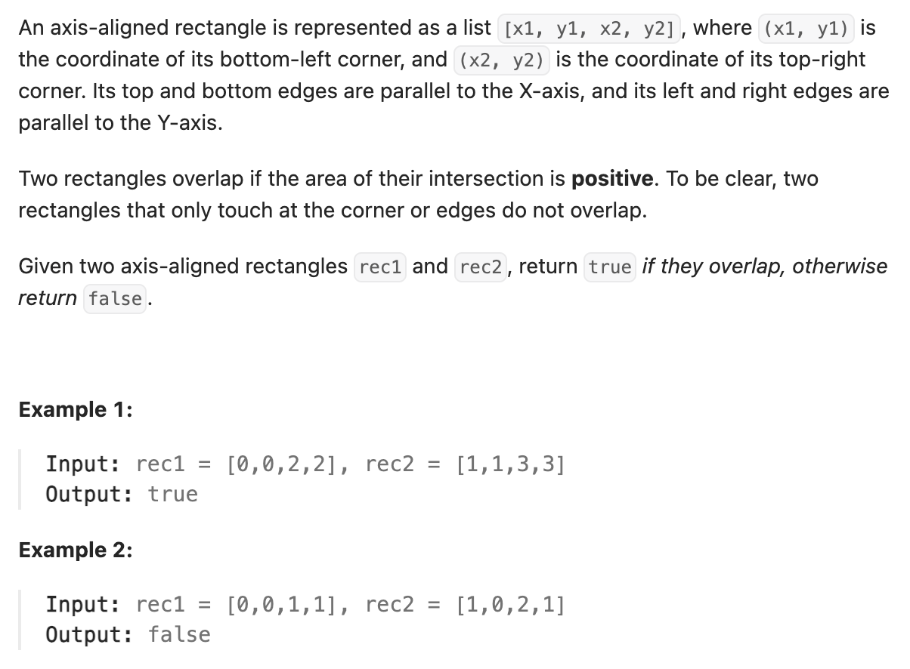

``` cpp
class Solution {
public:
    bool isRectangleOverlap(vector<int>& rec1, vector<int>& rec2) {
        // 判断没有重叠会更方便

        // 情况1: rec2的x1在rec1的x2右边，或者x2在rec1的x1左边
        if (rec2[0] >= rec1[2] || rec2[2] <= rec1[0]) {
            return false;
        }

        // 情况2: rec2的y1在rec1的y2上面，或者y2在rec1的y1下面
        if (rec2[1] >= rec1[3] || rec2[3] <= rec1[1]) {
            return false;
        }

        return true;
    }
};
```
