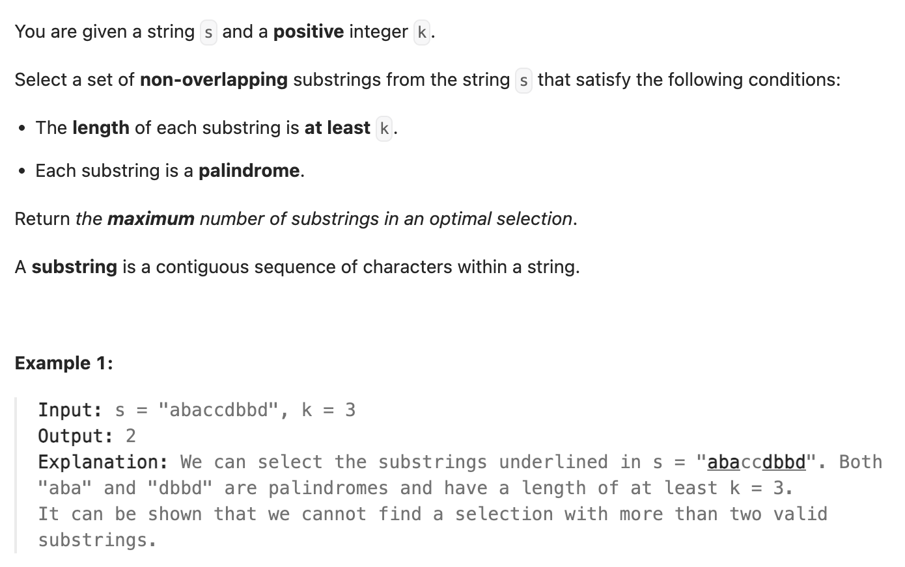

``` cpp
class Solution {
public:
    int maxPalindromes(string s, int k) {
        // 为了能让数量最大，我们只需要保存长度为k或者k+1的子串

        if (s.size() < k) {
            return 0;
        }

        int result = 0;
        int start = 0; // 目前子串至少从什么地方开始（防止重合）

        // i表示这一位作为子串末尾
        for (int i = k - 1; i < s.size(); i++) {
            if (i - k + 1 >= start && isPalindrom(s, i - k + 1, i)) {
                result++;
                start = i + 1;
            } else if (i - k >= start && isPalindrom(s, i - k, i)) {
                result++;
                start = i + 1;
            }
        }

        return result;
    }

    // 判断子串是否回文
    // 注意使用const string&可以高效地读取字符串
    bool isPalindrom(const string& s, int left, int right) {
        while (left <= right) {
            if (s[left] != s[right]) {
                return false;
            }
            left++;
            right--;
        }
        return true;
    }
};
```
