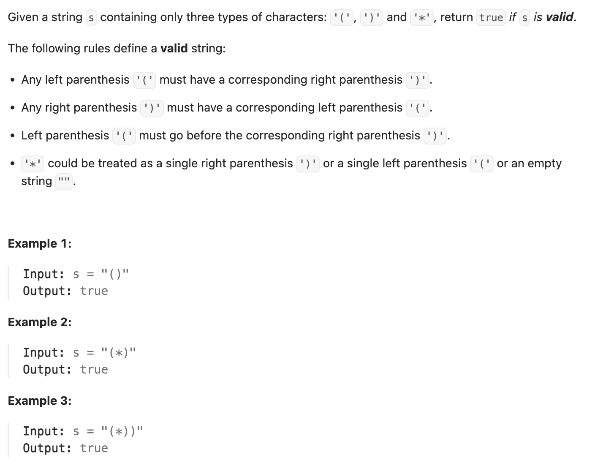

``` cpp
class Solution {
public:
    bool checkValidString(string s) {
        // 遍历两次
        // 第一次从左往右，确保每一个前缀的左括号足够匹配右括号
        // 第二次同理，从右往左

        int cnt = 0;
        // 数左括号
        for (int i = 0; i < s.size(); i++) {
            if (s[i] == '(' || s[i] == '*') {
                cnt++;
            } else {
                cnt--;
            }

            if (cnt < 0) {
                return false;
            }
        }

        cnt = 0;
        // 数右括号
        for (int i = s.size() - 1; i >= 0; i--) {
            if (s[i] == ')' || s[i] == '*') {
                cnt++;
            } else {
                cnt--;
            }

            if (cnt < 0) {
                return false;
            }
        }

        return true;
    }
};
```
