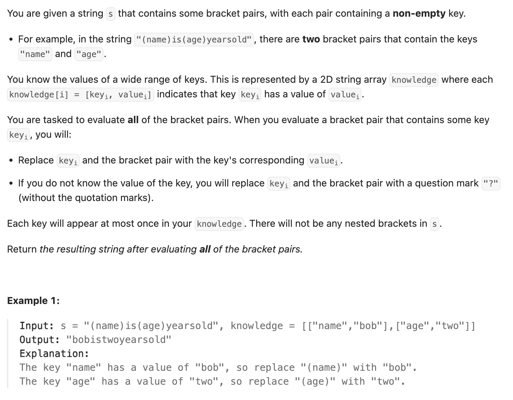

``` cpp
class Solution {
public:
    string evaluate(string s, vector<vector<string>>& knowledge) {
        unordered_map<string, string> table;
        for (int i = 0; i < knowledge.size(); i++) {
            table[knowledge[i][0]] = knowledge[i][1];
        }

        int x = 0;
        string result;
        while (x < s.size()) {
            // 是左括号，进行替换
            if (s[x] == '(') {
                string cur;
                x++;
                while (s[x] != ')') {
                    cur += s[x];
                    x++;
                }
                if (table.find(cur) != table.end()) {
                    result += table[cur];
                }
                else {
                    result += '?';
                }
                x++;
            }
            else {
                result += s[x];
                x++;
            }
        }

        return result;
    }
};
```
