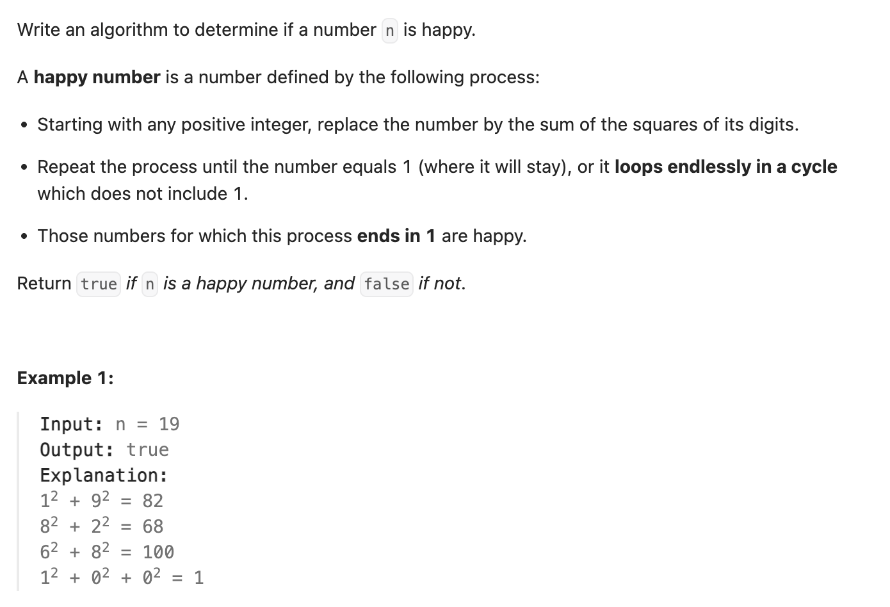

``` cpp
class Solution {
public:
    // 本题的关键在于，要不进入环，要不进入1
    // 所以相当于判断有没有环
    // 当然可以用哈希表来检查数字是否出现过。不过用判圈算法空间复杂度更小（为1）
    bool isHappy(int n) {
        int fast = n;
        int slow = n;

        while (fast != 1) {
            fast = getNextNum(getNextNum(fast));
            slow = getNextNum(slow);
            if (fast == 1) {
                return true;
            }
            if (fast == slow) {
                return false;
            }
        }
        return true;
    }

    int getNextNum(int n) {
        int result = 0;
        while (n > 0) {
            int digit = n % 10;
            result += digit * digit;
            n /= 10;
        }
        return result;
    }
};
```
