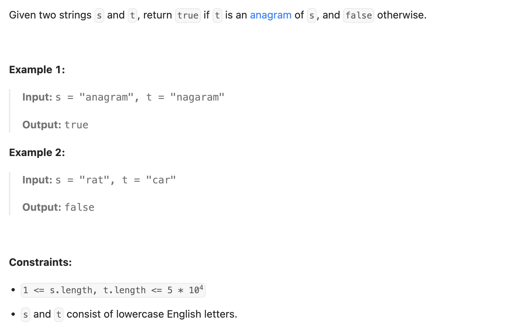

``` cpp
class Solution {
public:
    bool isAnagram(string s, string t) {
        // 如果大小不同，那不可能是anagram
        if (s.size() != t.size()) {
            return false;
        }

        // 用哈希表存s的字符，这里因为只有小写字母，可以直接用vector
        vector<int> table(26, 0);
        for (char x : s) {
            table[x - 'a']++;
        }

        for (char x : t) {
            if (table[x - 'a'] == 0) {
                return false;
            } else {
                table[x - 'a']--;
            }
        }

        return true;
    }
};
```
