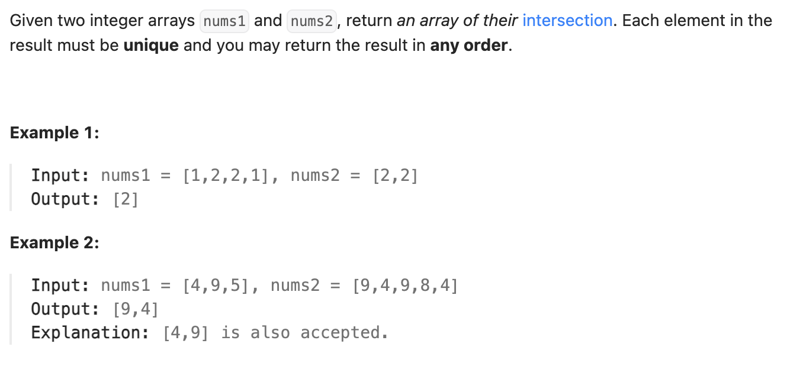

``` cpp
class Solution {
public:
    vector<int> intersection(vector<int>& nums1, vector<int>& nums2) {
        vector<int> result;

        unordered_map<int, int> mp;

        // 把nums1存进去
        for (int n : nums1) {
            mp[n]++;
        }
        
        // 看nums2的数字nums1有没有
        for (int n : nums2) {
            if (mp[n] != 0) {
                result.push_back(n);
                mp[n] = 0; // 变回0，防止重复加入交集
            }
        }

        return result;
    }
};
```
