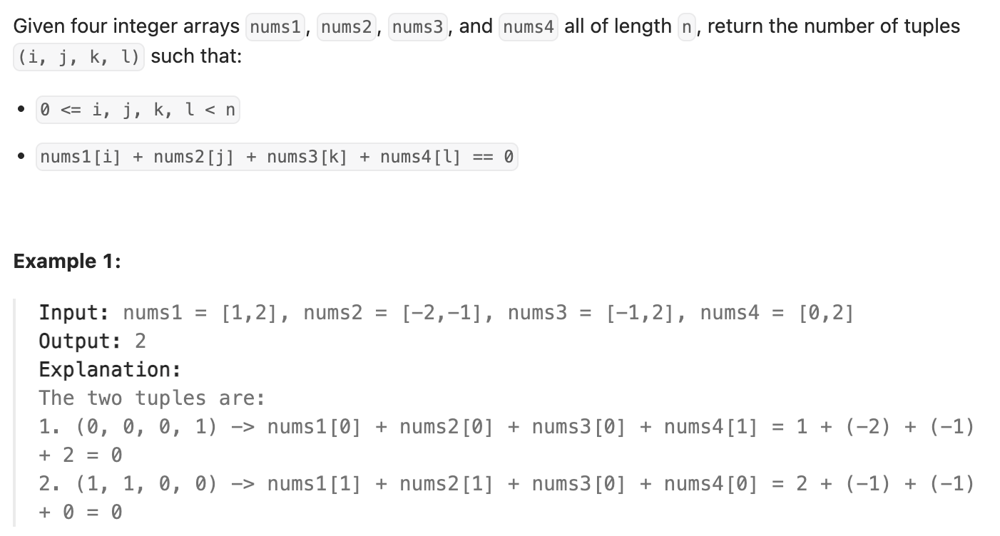

``` cpp
class Solution {
public:
    int fourSumCount(vector<int>& nums1, vector<int>& nums2, vector<int>& nums3,
                     vector<int>& nums4) {
        // 两两分组，先把A+B所有可能的结果存入哈希表
        unordered_map<int, int> table;
        for (int a : nums1) {
            for (int b : nums2) {
                table[a + b]++;
            }
        }

        // 再用C+D去检查可能性
        int result = 0;
        for (int c : nums3) {
            for (int d : nums4) {
                result += table[0 - c - d];
            }
        }

        return result;
    }
};
```