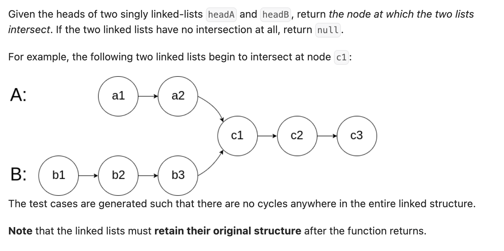

``` cpp
/**
 * Definition for singly-linked list.
 * struct ListNode {
 *     int val;
 *     ListNode *next;
 *     ListNode(int x) : val(x), next(NULL) {}
 * };
 */
class Solution {
public:
    ListNode *getIntersectionNode(ListNode *headA, ListNode *headB) {
        // 假设链表1长度小于链表2
        // 用双指针，当一方(a)抵达链表1末尾的时候，另一方到中间
        // 此时另一方(b)距离链表2末尾的长度刚好是两个链表长度之差
        // 用a重新遍历链表2，b到末尾的时候，刚好消除了两个链表长度之差
        // 此时b从链表1开始走，和a距离交点长度一定一样，当a=b，就找到了答案

        ListNode* a = headA;
        ListNode* b = headB;

        while (a != b) {
            if (a == nullptr) {
                a = headB;
            } else {
                a = a->next;
            }

            if (b == nullptr) {
                b = headA;
            } else {
                b = b->next;
            }
        }

        return a;
    }
};
```
