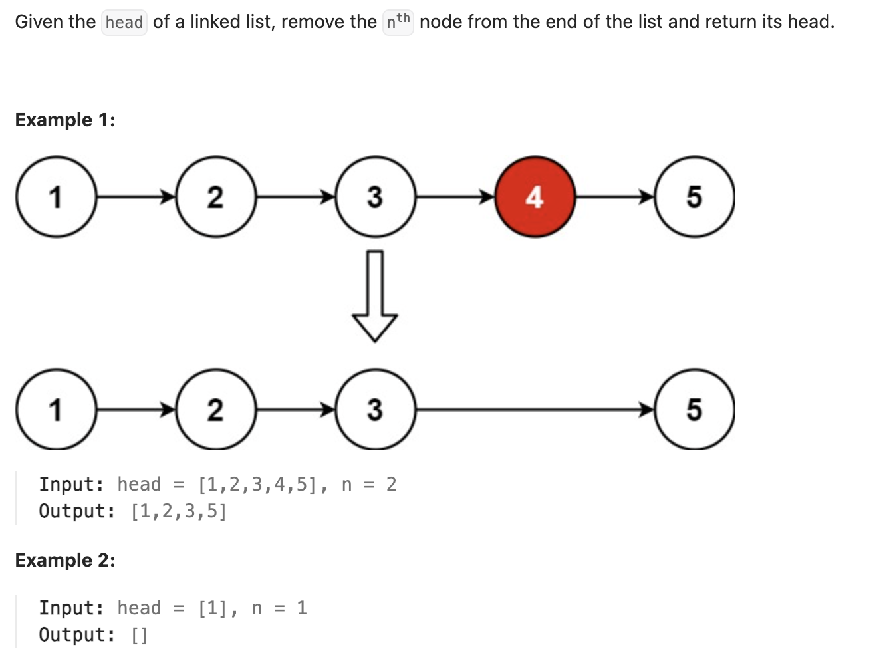

``` cpp
/**
 * Definition for singly-linked list.
 * struct ListNode {
 *     int val;
 *     ListNode *next;
 *     ListNode() : val(0), next(nullptr) {}
 *     ListNode(int x) : val(x), next(nullptr) {}
 *     ListNode(int x, ListNode *next) : val(x), next(next) {}
 * };
 */
class Solution {
public:
    ListNode* removeNthFromEnd(ListNode* head, int n) {
        // 非常天才的双指针！
        // 快指针比慢指针多走n格，快指针下一个是nullptr的时候，删除的正是慢指针下一个

        // 注意如果删除head的话会有所不同最后不能返回head，所以要用到dummyHead
        ListNode* dummyHead = new ListNode(0, head);
        ListNode* fast = dummyHead;
        ListNode* slow = dummyHead;

        for (int i = 0; i < n; i++) {
            fast = fast->next;
        }

        while (fast->next != nullptr) {
            fast = fast->next;
            slow = slow->next;
        }

        // ListNode* temp = slow->next;
        slow->next = slow->next->next;
        // delete temp;

        return dummyHead->next;

    }
};
```
