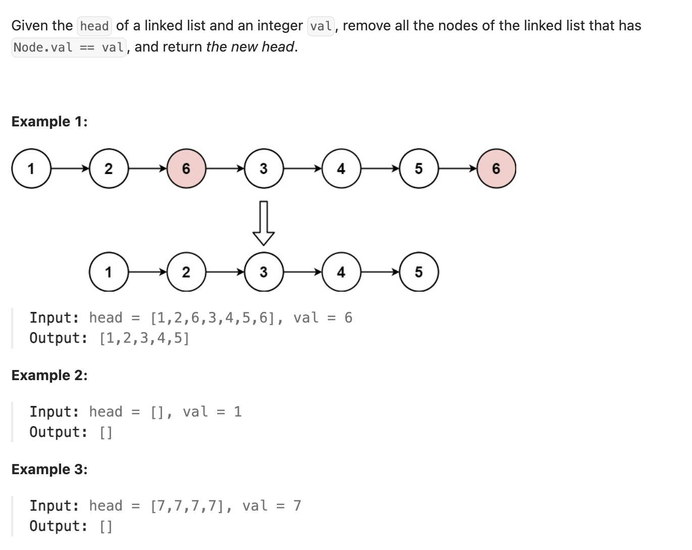

``` cpp
/**
 * Definition for singly-linked list.
 * struct ListNode {
 *     int val;
 *     ListNode *next;
 *     ListNode() : val(0), next(nullptr) {}
 *     ListNode(int x) : val(x), next(nullptr) {}
 *     ListNode(int x, ListNode *next) : val(x), next(next) {}
 * };
 */
class Solution {
public:
    ListNode* removeElements(ListNode* head, int val) {
        // 力扣里不强调生命周期，所以不写delete也没太大关系
        // 现实中还是要写的！
        
        ListNode* dummyHead = new ListNode();
        dummyHead->next = head;
        ListNode* temp = dummyHead;

        while (temp->next != nullptr) {
            if (temp->next->val == val) {
                //ListNode* toDelete = temp->next;
                temp->next = temp->next->next;
                //delete toDelete;
            } else {
                temp = temp->next;
            }
        }

        return dummyHead->next;
    }
};
```
