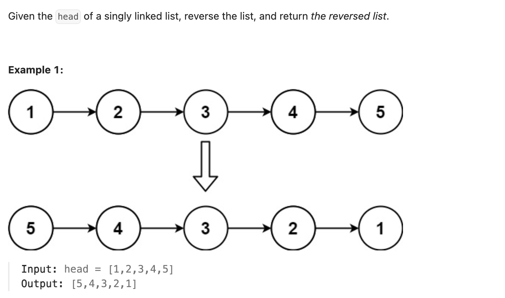

``` cpp
/**
 * Definition for singly-linked list.
 * struct ListNode {
 *     int val;
 *     ListNode *next;
 *     ListNode() : val(0), next(nullptr) {}
 *     ListNode(int x) : val(x), next(nullptr) {}
 *     ListNode(int x, ListNode *next) : val(x), next(next) {}
 * };
 */
class Solution {
public:
    ListNode* reverseList(ListNode* head) {
        if (head == nullptr) {
            return nullptr;
        }

        ListNode* prev = nullptr; // 当前节点的前一个节点
        ListNode* curr = new ListNode(); // 当前节点的后一个节点

        while (head != nullptr) {
            curr = head->next;
            head->next = prev; // 把指向后一个节点的指针改成指向前一个节点
            prev = head;
            head = curr;
        }

        return prev; // 最后head变为nullptr了
    }
};
```

