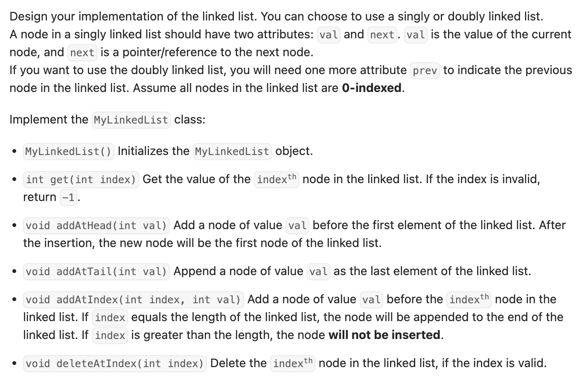

``` cpp
/**
 * Definition for singly-linked list.
 * struct ListNode {
 *     int val;
 *     ListNode *next;
 *     ListNode() : val(0), next(nullptr) {}
 *     ListNode(int x) : val(x), next(nullptr) {}
 *     ListNode(int x, ListNode *next) : val(x), next(next) {}
 * };
 */

class MyLinkedList {
private:
    int size; // 主要用来判断index的合法性
    ListNode* dummyHead;

public:
    MyLinkedList() {
        size = 0;
        dummyHead = new ListNode();
    }

    int get(int index) {
        // 根据要求，需要判断index是否合法，不合法返回-1
        if (index < 0 || index >= size) {
            return -1;
        }

        ListNode* head = dummyHead->next;
        for (int i = 0; i < index; i++) {
            head = head->next;
        }
        return head->val;
    }

    void addAtHead(int val) {
        addAtIndex(0, val);
    }

    void addAtTail(int val) {
        addAtIndex(size, val);
    }

    void addAtIndex(int index, int val) {
        if (index > size) {
            return;
        }
		
		// 要搞清楚到底在找谁！找要加入的前一个即可！
        ListNode* head = dummyHead;
        for (int i = 0; i < index; i++) {
            head = head->next;
        }
        ListNode* newNode = new ListNode(val);
        newNode->next = head->next;
        head->next = newNode;

        size++;
    }

    void deleteAtIndex(int index) {
        if (index < 0 || index >= size) {
            return;
        }
		
		// 同样的，找要删掉的前一个。
        ListNode* head = dummyHead;
        for (int i = 0; i < index; i++) {
            head = head->next;
        }
        ListNode* temp = head->next;
        head->next = head->next->next;
        delete temp;

        size--;
    }
};

/**
 * Your MyLinkedList object will be instantiated and called as such:
 * MyLinkedList* obj = new MyLinkedList();
 * int param_1 = obj->get(index);
 * obj->addAtHead(val);
 * obj->addAtTail(val);
 * obj->addAtIndex(index,val);
 * obj->deleteAtIndex(index);
 */
```
