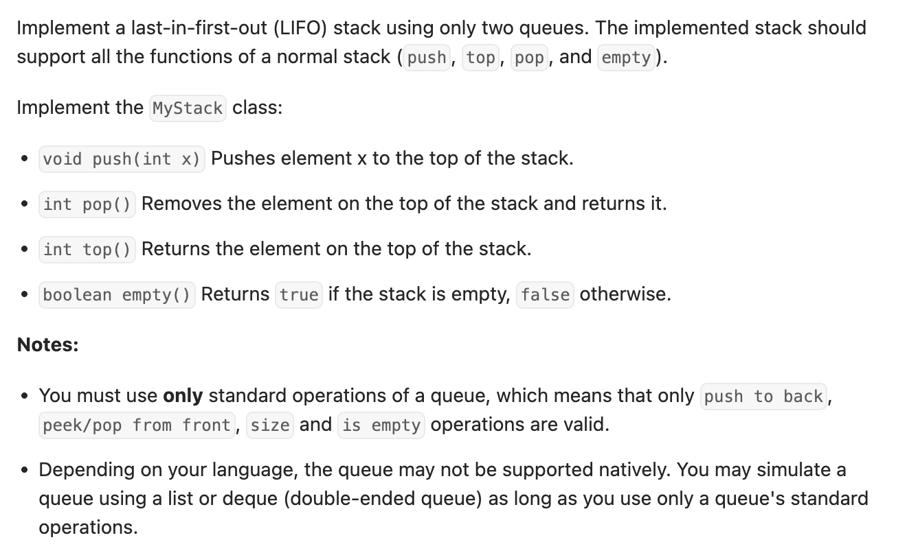

``` cpp
class MyStack {
private:
    queue<int> q;

public:
    MyStack() { }
    
    void push(int x) {
        q.push(x);
    }
    
    int pop() {
        int cur = q.front();
        for (int i = 1; i < q.size(); i++) {
            cur = q.front();
            q.pop();
            q.push(cur);
        }
        cur = q.front();
        q.pop();
        return cur;
    }
    
    int top() {
        int cur = q.front();
        for (int i = 1; i <= q.size(); i++) {
            cur = q.front();
            q.pop();
            q.push(cur);
        }
        return cur;
    }
    
    bool empty() {
        if (q.empty()) {
            return true;
        }
        else {
            return false;
        }
    }
};

/**
 * Your MyStack object will be instantiated and called as such:
 * MyStack* obj = new MyStack();
 * obj->push(x);
 * int param_2 = obj->pop();
 * int param_3 = obj->top();
 * bool param_4 = obj->empty();
 */
```