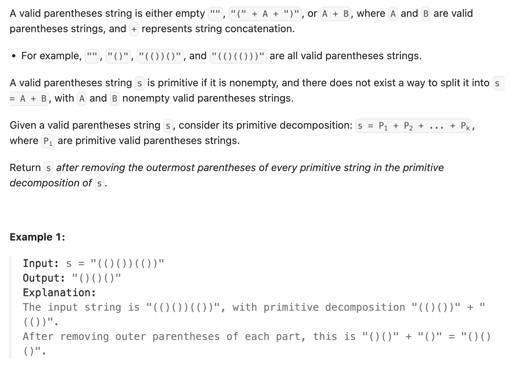

``` cpp
class Solution {
public:
    string removeOuterParentheses(string s) {
        int left = 0;
        string result;

        // 每次left清零了就说明是最外层的括号
        for (char x : s) {
            if (x == '(') {
                if (left == 0) {
                    left++;
                } else {
                    left++;
                    result.push_back('(');
                }
            } else {
                if (left == 1) {
                    left--;
                } else {
                    left--;
                    result.push_back(')');
                }
            }
        }

        return result;
    }
};
```
