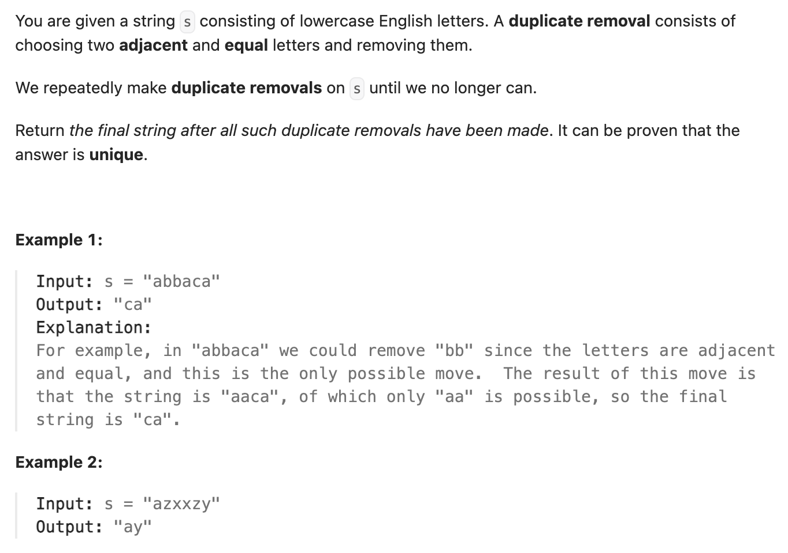

``` cpp
class Solution {
public:
    string removeDuplicates(string s) {
        // string本身就有栈的特性，所以可以直接用string
        string result;
        for (char x : s) {
            if (!result.empty() && result.back() == x) {
                result.pop_back();
            }
            else {
                result.push_back(x);
            }
        }

        return result;
    }
};
```
