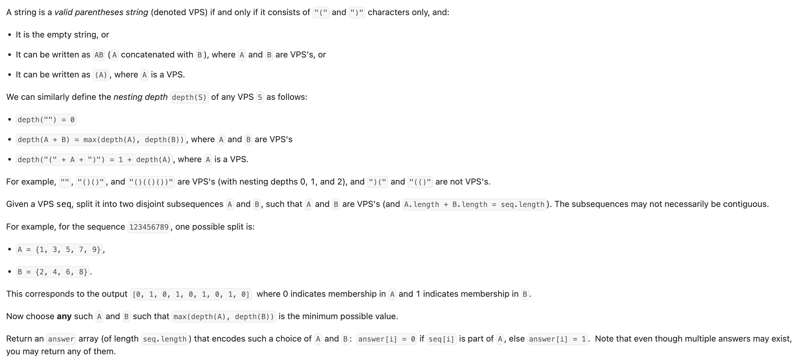

``` cpp
class Solution {
public:
    vector<int> maxDepthAfterSplit(string seq) {
        // 计算最大深度
        int left = 0;
        int depth = 0;

        for (char x : seq) {
            if (x == '(') {
                left++;
            }
            if (x == ')') {
                depth = max(depth, left);
                left--;
            }
        }

        // 深度大于等于最大深度/2的放1， 其他放0
        vector<int> result;
        depth /= 2;
        for (char x : seq) {
            if (x == '(') {
                ++left;
            }

            result.push_back(left > depth);
            
            if (x == ')') {
                --left;
            }
        }

        return result;
    }
};
```
