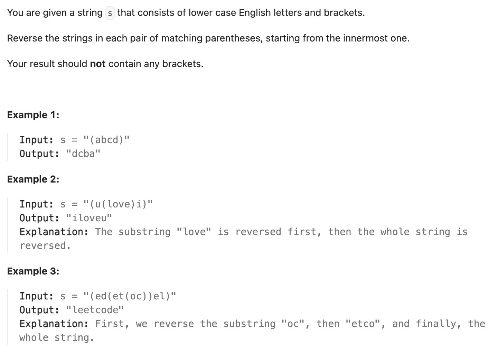

``` cpp
class Solution {
public:
    string reverseParentheses(string s) {
        vector<int> index(s.size());

        // 建立左右括号对应的索引，要用stack来配对
        stack<int> stk;
        for (int j = 0; j < s.size(); j++) {
            if (s[j] == '(') {
                stk.push(j);
            }
            else if (s[j] == ')') {
                index[j] = stk.top();
                index[stk.top()] = j;
                stk.pop();
            }
        }

        int i = 0;
        int step = 1;
        string result;
        while (i < s.size()) {
            if (s[i] == '(' || s[i] == ')') {
                i = index[i];
                step *= -1;
                i += step;
            }
            else{
                result.push_back(s[i]);
                i += step;
            }
        }

        return result;
    }
};
```

.png)