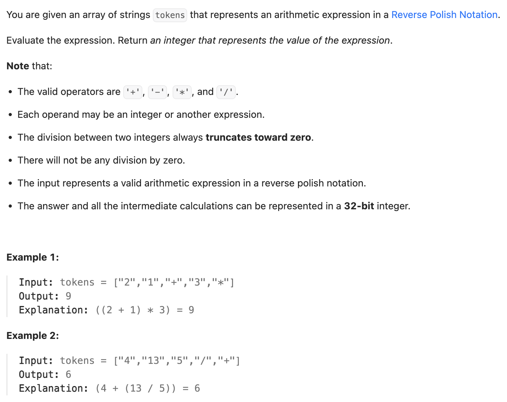

``` cpp
class Solution {
public:
    int evalRPN(vector<string>& tokens) {
        stack<int> stk;

        for (int i = 0; i < tokens.size(); i++) {
            if (tokens[i] == "+") {
                int a2 = stk.top();
                stk.pop();
                int a1 = stk.top();
                stk.pop();
                stk.push(a1 + a2);
            }
            // stack后进先出，注意a1和a2的顺序
            else if (tokens[i] == "-") {
                int a2 = stk.top();
                stk.pop();
                int a1 = stk.top();
                stk.pop();
                stk.push(a1 - a2);
            }
            else if (tokens[i] == "*") {
                int a2 = stk.top();
                stk.pop();
                int a1 = stk.top();
                stk.pop();
                stk.push(a1 * a2);
            }
            else if (tokens[i] == "/") {
                int a2 = stk.top();
                stk.pop();
                int a1 = stk.top();
                stk.pop();
                // C++里，两个整数做除法(/)时，本身就是向0截断
                stk.push(a1 / a2);
            }
            else {
                stk.push(stoi(tokens[i]));
            }
        }

        return stk.top();
    }
};
```
