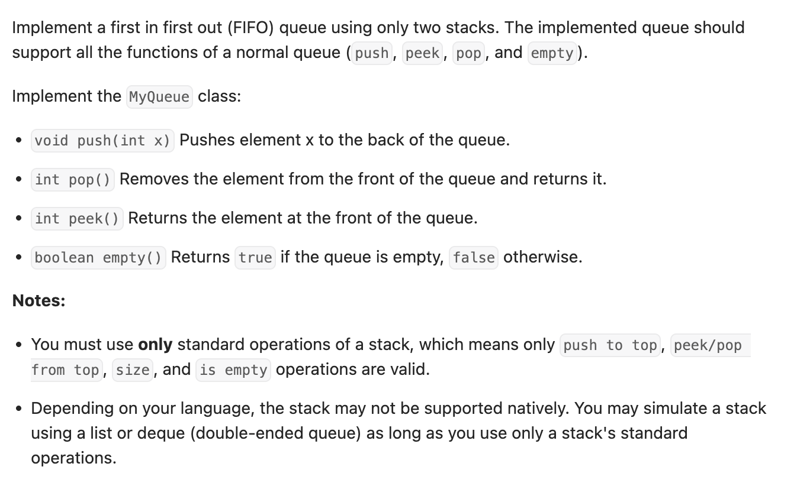

``` cpp
class MyQueue {
private:
    stack<int> input_st;  // 输入栈
    stack<int> output_st; // 输出栈

public:
    MyQueue() {}

    void push(int x) { input_st.push(x); }

    int pop() {
        // 如果输出栈为空，把输入栈数据押入
        if (output_st.empty()) {
            while (!input_st.empty()) {
                output_st.push(input_st.top());
                input_st.pop();
            }
        }
        int result = output_st.top();
        output_st.pop();
        return result;
    }

    int peek() {
        if (output_st.empty()) {
            while (!input_st.empty()) {
                output_st.push(input_st.top());
                input_st.pop();
            }
        }
        return output_st.top();
    }

    bool empty() {
        if (output_st.empty() && input_st.empty()) {
            return true;
        } else {
            return false;
        }
    }
};

/**
 * Your MyQueue object will be instantiated and called as such:
 * MyQueue* obj = new MyQueue();
 * obj->push(x);
 * int param_2 = obj->pop();
 * int param_3 = obj->peek();
 * bool param_4 = obj->empty();
 */
```
